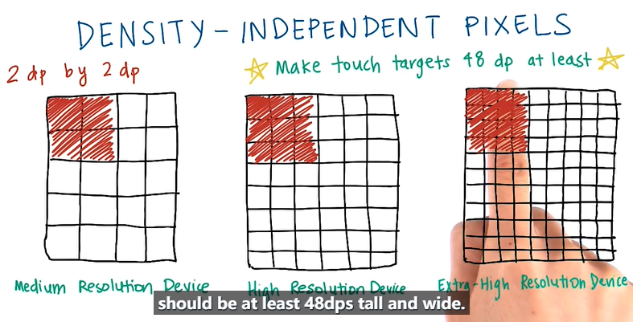
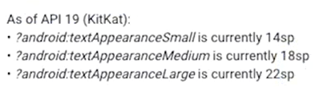
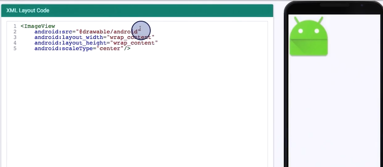
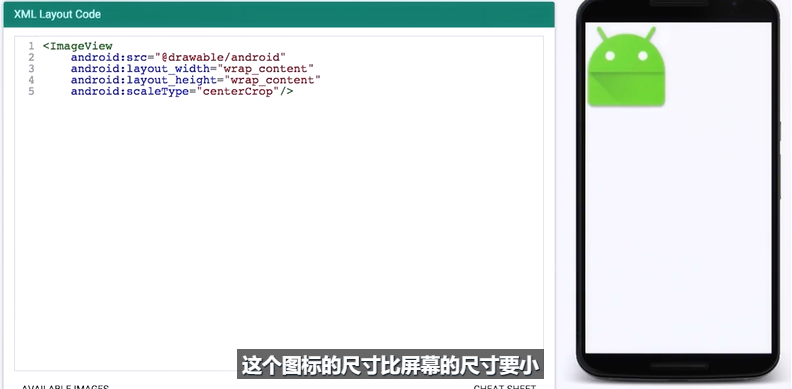
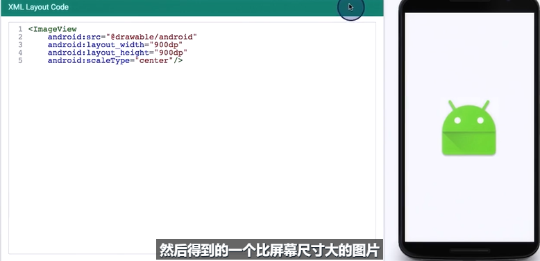
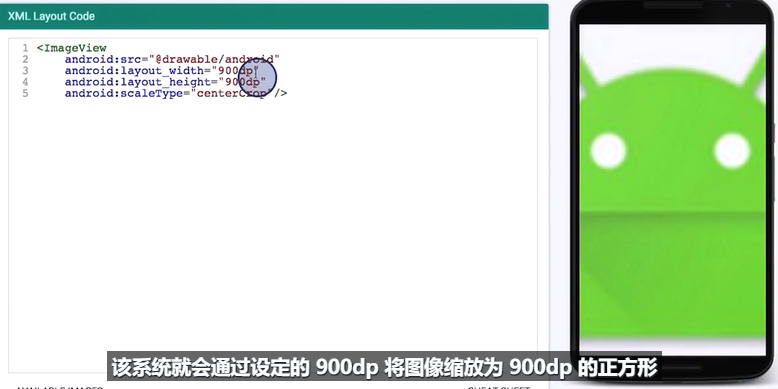

[Android学习博客](https://codeteenager.github.io/android/android42.html)

## 一、规范
### （一）XML

`Button`长宽不得低于`48dp`，否则在高分辨率的设备中会很小。

（`48dp`约为`9mm`）




### （二）使用统一标准字号



```xml
<TextView
          ...
          android:TextApperance="?android:textAppertanceLarge"
          />
```


### （三）控件间距

`margin`和`padding`的大小建议以`8dp`为单位，以它的倍数来设置。


## 二、布局

### （一）图片适配屏幕

`scaleType`属性：`center`与`centerCrop`

当图片大小大于屏幕时，`center`不会改变图片大小，直接居中显示；`centerCrop`会按比例缩小到屏幕尺寸，并居中显示。

当图片大小小于屏幕时，若`ImageView`的大小没有固定，两个参数均无效；当把`ImageView`的大小固定为超过屏幕尺寸时，`center`将居中显示，`centerCrop`将按比例放大图片，自适应到`ImageView`的大小居中显示。






固定`ImageView`的大小后：






### （二）圆角布局

`Drawable`中创建`xml`文件，设置为控件的背景。

```xml
<?xml version="1.0" encoding="UTF-8"?>
<shape xmlns:android="http://schemas.android.com/apk/res/android">
    <solid android:color="#FFFFFF"/>

    <!-- 边缘 -->
    <stroke android:width="3dp" android:color="#B1BCBE" />

    <!--  圆角半径  -->
    <corners android:radius="10dp"/>

    <!--  内边距  -->
    <padding android:left="0dp" android:top="0dp" android:right="0dp" android:bottom="0dp" />
</shape>
```


## 三、安卓四大组件

### （一）Activity

一个Activity是一个单独的窗口/屏幕。


### （二）Service

`startService()`可以由其他组件调用，该组件的生命周期结束后，`Service`依旧可以保持启动状态不受影响。用`stopService()`关闭。

`BindService()`，`Service`与调用者的生命周期绑定在一起，即“不求同时生，必须同时死”。用`unBindService()`关闭。


### （三）content provider

* 需要在多个应用程序间共享数据时，才需要content provider。它将一个应用程序的指定数据集提供给其他应用程序。
* Content Provider用于保存和获取数据，并使其对所有应用程序可见。这是不同应用程序间共享数据的唯一方式，因为android没有提供所有应用共同访问的公共存储区。


### （四）broadcast receiver

* 在AndroidManifest文件中进行配置的广播接收者（静态注册），会随系统的启动而一直处于活跃状态，只要接收到感兴趣的广播就会触发（即使程序未运行）。
* 当发生电话呼入/数据网络可用等事件时，可通过广播接收器进行接收并做出响应。它没有用户界面。可以启动一个`activity`或`service`来响应它们收到的信息，或者用`NotificationManager`来通知用户。


### （五）android中的任务（activity栈）

* 栈顶是当前运行的`Activity`，新的在栈顶入栈，返回时出栈。
* 栈中的`Activity`永远不会重排，只会压入或弹出。


### （六）Activity携带数据跳转

从`Activity A`跳转到`Activity B`

**Activity A**

```kotlin
// 从A中打开B
var intent = Intent() 
intent.putExtra("data","hello")
intent.setClass(this, B::class.java)  //(当前Activity，目标Activity)  
startActivityForResult(intent, 1)  // 1是请求的标识requestCode
```

```kotlin
/**
* Activity A中收取从B返回得到的数据
* requestCode A请求的标识
* resultCode 从B返回的标识
* data 从B返回的数据
*/
override fun onActivityResult(requestCode: Int, resultCode: Int, data: Intent?) {
	super.onActivityResult(requestCode, resultCode, data)
    // ...
}
```

**Activity B**

```kotlin
// 返回数据
var data = Intent()
data.putExtra("data", "回传数据")
setResult(2, data);  // 2是返回的标识resultCode
finish()
```


## 四、常用设计模式

### （一） 观察者模式

**使用LiveData/MutableLiveData和Observer进行数据观测：**

1. 在LiveData中放入需要被观测的数据

   ```kotlin
   val data = LiveData<Int>()
   ```

2. 创建Observer，表明该数据变化后要进行的操作

   ```kotlin
   val myObserver = Observer<Int>{
       if(it == 1){
           // 一些被触发的操作
       }
   }
   ```

3. 观察

   ```kotlin
   data.observe(this,loginObserver)
   ```

4. 数据改变

   ```
   data.postValue(1)
   ```

   这样，当`data`发生改变时就会触发`myObserver`进行一些操作。


## 五、常用组件

### （一）`navigation`

参考博客：`https://blog.csdn.net/mq2553299/article/details/80445952`

官方教程：`https://developer.android.com/guide/navigation`

