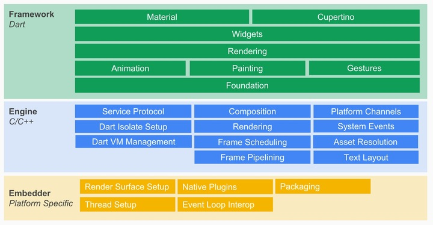
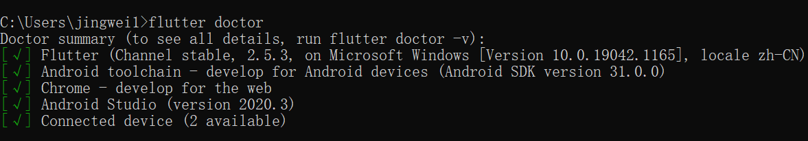

## 基本资料

Flutter 是 Google 开源的 UI 工具包，帮助开发者通过一套代码库高效构建多平台精美应用，支持移动、Web、桌面和嵌入式平台。

Flutter 之前的跨平台移动应用解决方案，有两大主流思路：

1) 利用 DOM 来渲染 UI。撰写 JavaScript，然后将其打包到一个移动应用中。

2) 把 JavaScript 映射到原生 UI，使用原生 UI 的能力。

而 flutter 更像是一个游戏引擎，它构建在一个 2D 图形引擎 Skia 之上。（Skia 性能非常优秀，是 chrome 和 android 内置的图形引擎）

**Flutter 主要分为三个核心模块：**

1. Framework：基于 Dart 语言构建的 framework，包括了动画以及各种组件；
2. Engine：基于 C/C++ 构建的引擎，包括了 Skia 和 Dart VM, 以及在不同平台实现的 shell 层，Engine 通过封装好的 Embedder API 去调用不同平台的能力；
3. Embedder：嵌入层，将 Flutter 嵌入到各个平台上。Embedder 负责范围包括原生平台插件、线程管理、事件循环等。

**优点：**

2. 性能好

   Flutter 不依赖已有的渲染引擎，而是自己控制屏幕上的每一个像素的渲染。 flutter 宣称自己的渲染能力是 60 fps ，从用户输入到最终渲染，会经历以下 pipeline：

   `User Input`->`Animation`->`Build`->`Layout`->`Paint`->`Composite`->`Rasterize`

3. 跨平台潜力高

   flutter 可以很容易地将移动端应用扩展到客户端、Web 等。目前已经支持的平台有：`Android`、`IOS`、`Linux`、`macOS`、`Web`、`Windows`。

4. 开发效率高

   使用 dart 语言，支持 `AOT`（Ahead Of Time）和 `JIT`（Just In Time），可以实现类似 web 开发的那种「边写边调」的极致体验。

5. 已支持鸿蒙系统

**缺点：**

1. 脱离不开原生，需要双端都熟悉
2. 原生集成第三方 SDK ，适配性差
3. UI控件API简陋，许多控件属性无法自定义
4. 代码可读性差
5. 打包后的 apk 过大

## 能够实现的功能

### 1. 用户界面

1. Widget

   Flutter 从 React 中吸取灵感，通过现代化框架创建出精美的组件。它的核心思想是用 widget 来构建 UI 界面。常用的有：`Text`、`Row`、`Column`、`Stack`、`Container`等。

2. 页面布局

   Flutter 布局的核心机制是 widgets，它是用于构建 UI 的类。在 Flutter 中，几乎所有东西都是 widget ， 甚至布局模型都是 widgets。从而可以后见响应式和自适应的应用。

   widgets 分为有状态和无状态，有状态的 widgets 可以和用户进行交互，而无状态的 widgets 自身无法改变。

3. 路由导航

   Flutter 的路由机制有： Navigator widgets 和 Router widgets。跳转到其他页面、打开弹窗等都需要用到路由导航，同时可以进行页面之间的数据传递。

4. 动画效果

   Flutter 中的动画系统基于 Animation ， Widgets 可以直接将这些动画合并到自己的 build 方法中来读取它们的当前值或者监听它们的状态变化，或者可以将其作为的更复杂动画的基础传递给其他 widgets。

   动画分为补间动画(Tween Animation)和基于物理的动画(Physics-based Animation)，使得组件的运动轨迹灵活多变，从而可以实现组件的线性、非线性匀速运动动画，改变组件的圆角、颜色、阴影、变换等。动画的渲染自由、灵活、高效。

   

### 2. 用户交互

在移动端的用户交互事件既是用户的手势操作处理，它在 flutter 中可分为两类：

- 第一类是原始的指针事件（Pointer Event），即原生开发中常见的触摸事件，表示屏幕上触摸（或鼠标、手写笔）行为触发所的位移行为。

- 第二类则是手势识别（Gesture Detector），表示多个原生指针事件的组合操作，如点击、双击、长按、等，是指针事件的语义化封装。

  

### 3. 基础能力

1. 本地存储

   Flutter支持Preferences 、文件、和Sqlite3，需要引入官方仓库的相应插件。

2. 网络协议

   Flutter 支持 HTTP 协议、web socket 协议，以及 Socket 协议。由 HttpServer 类和 HttpClient 类提供 HTTP 服务器和客户端功能。

3. UI 渲染

   在 Flutter 中 Widget 是核心，一起协同工作的还有另外两个元素：Element 和 RenderObject。由于它们都是有着树形结构，所以经常会称它们为三棵树。

   当应用启动时 Flutter 会遍历并创建所有的 Widget 形成 Widget Tree ，通过调用 Widget 上的 createElement()  方法创建每个 Element 对象，形成 Element Tree。后调用 Element 的 createRenderObject() 方法创建每个渲染对象，形成一个 Render Tree。

### 4. 组件封装

1. 基础组件

   基础组件包括图片、`Icon`、`Text`、按钮、单选开关、复选框、输入框、表单、进度指示器等。

2. 扩展组件

   `Container`、`AlertDialog`、`AppBar`、`Clip`、`Card`、`DataTable`、`Stack`等。

3. 生命周期

   Flutter 中说的生命周期，是指有状态组件，无状态组件的生命周期只有`Build`。

   其生命周期为：

   - **createState** ：用于创建 State
   - **initState**：为 State 初始化时调用
   - **didChangeDependencies** ：在该组件依赖的 State 发生变化时调用

   - **build** ：主要是返回需要渲染的 Widget ，由于 build 会被调用多次，因此在该函数中只能做返回 Widget 相关逻辑，避免因为执行多次导致状态异常。
   - **reassemble** ：主要是提供开发阶段使用，在 debug 模式下，每次热重载都会调用该函数，因此在 debug 阶段可以在此期间增加一些 debug 代码，来检查代码问题。
   - **didUpdateWidget** ：该函数主要是在组件重新构建，比如说热重载，父组件发生 build 的情况下，子组件该方法才会被调用，其次该方法调用之后一定会再调用本组件中的 build 方法。
   - **deactivate** ：在组件被移除节点后会被调用，如果该组件被移除节点，然后未被插入到其他节点时，则会继续调用 dispose 永久移除。
   - **dispose** ：永久移除组件，并释放组件资源。

## 安装和环境配置

1. 下载`Flutter`：[Windows版中国镜像]([`https://storage.flutter-io.cn/flutter_infra_release/releases/stable/windows/flutter_windows_v1.0.0-stable.zip`](https://storage.flutter-io.cn/flutter_infra_release/releases/stable/windows/flutter_windows_v1.0.0-stable.zip))，最好不要安装到权限过高的文件夹。

2. 配置环境变量，可以通过`where flutter dart`查看环境变量配置是否成功

3. 在`cmd`中输入`flutter doctor`，根据提示下载缺少的插件。

4. 输入`flutter doctor --android-licenses`进行协议的确认，后续一直输`y`即可。

5. 正确配置后显示：

   

## 参考文献

[Flutter 是什么？](https://www.jianshu.com/p/51e989500ca3) by Brant白叔

[flutter: 一周感悟](https://zhuanlan.zhihu.com/p/126452592) by 陈天

[开始使用Flutter](https://flutter.cn/docs/get-started/install) by Flutter

[在 Windows 操作系统上安装和配置 Flutter 开发环境](https://flutter.cn/docs/get-started/install/windows) by Flutter

[在中国网络环境下使用Flutter](https://flutter.cn/community/china) by Flutter

[API文档](https://api.flutter-io.cn/) by Flutter

[官方实用教程](https://flutter.cn/docs/cookbook) by Flutter
