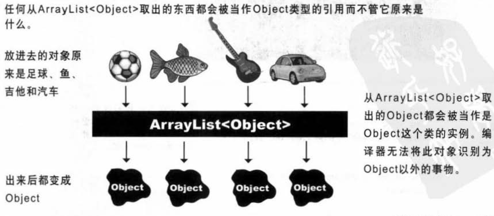
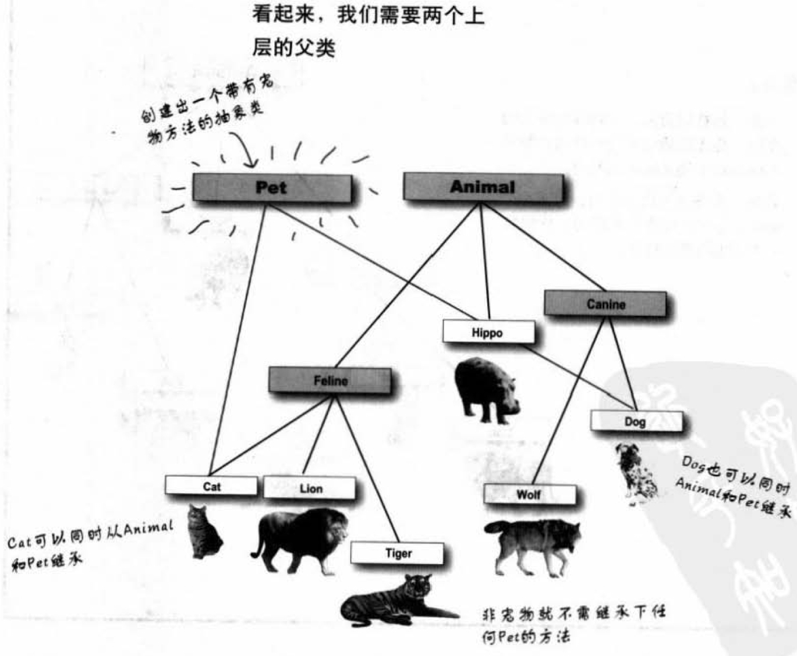

## 《Head First Java》读书笔记

### 1. 基本概念

* 源码`(.java)`由`javac`程序编译后生成代码`(.class)`，之后启动`Java`虚拟机`(JVM)`运行

* `Java`中的条件测试必须是`Boolean`值，不像`C++`中可以是整形。

* 输出字符串：
```java
public class BasicThree {
    public static void main(String[] args) {
        System.out.println(5+6+""+5+6);
        System.out.println('A'+5+"hello");
    }
}
// 输出：
// 1156
// 70hello
```

  1. 前面是单个字符(byte)的情况下，后面跟数字为加法运算符；
  2. 在遇到首个个字符之前，所有数遇`+`即`+`（单个字符`(byte)`的情况除外）；当遇到任意字符后，加号就变成了字符/字符串的拼接。

* `Java`是一个强类型语言，没有强制类型转化前,不允许两种不同类型的变量相互操作。

* 动态绑定：`Java`允许在执行期引用程序员没有预期到的类型。

* 编译器与虚拟机对比：

    编译器|虚拟机
    ---|---
    产生.class文件|执行文件
    检查数据类型、符号、违法调用private方法等|检查异常


### 2. 类与对象

* 对象被存放在可回收垃圾的堆上`(Gargage-Collectible Heap)`。

* 当某个对象被`JVM`察觉到不会再被使用，就会被标记为可回收的，当内存不够时，垃圾收集器会启动来清理垃圾、回收空间。
* 任何变量在加上`public`、`static`、`final`后，会变成全局变量取用的常熟


### 3. `primitive`主要数据和引用

#### 变量分为两种：

1. **`primitive`主要数据类型：**
   
   1. `boolean`：`true`或`false`
   2. `char`：0~65535
   3. `byte`：-128~128
   4. `short`：-32768~32767
   5. `int`： -2^{31} ~ 2^{31}-1 
   6. `long`： -2^{64} ~ 2^{64}-1 
   7. `float`：32bit，范围规模可变。注意，``float f = 1.2f``，要加上`f`，否则会被认为是`double`。
   8. `double`：64bit，范围规模可变
   
   小容量可以放进大容量的变量里，反之不行。
   
2. **引用：**

   * 所有的对象变量都是引用，真正的对象存放在堆中，变量里面存储的是指向对象的地址。

   * 对象在内存中的布局依次划分为3个区域：对象头(Header)，实例数据(Instance Data)以及对齐填充(Padding)。对齐填充是为了：使对象的大小必须是8字节的整数倍。

   * 所有的引用大小都一样。

     


#### 数组也是对象：

数组里可以放`primitive`主数据类型，也可以放对象引用。

```java
Dog[] dog = new Dog[10];	// Dog[] 是一个对象
for(int i=0;i<10;i++) {
    dog[0]=new Dog();	// 需要对每一个Dog应用变量进行赋值
}
```


### 4. 对象的行为

**参数传递：**（实参`argument`、形参`parameter`）

`Java`中的参数传递是值传递，传入的值被修改后不影响原值。若传入的参数是对象，那么实际传入的是“对象的控制”的一份拷贝，修改这个“控制”所指向的对象，也就是直接修改了原来的值。

**返回值：**

返回的数据类型可以隐含地放大，也可以明确地缩小。

若要返回多个值：

1. 同一类型的值：放入数组中返回
2. 不同类型的值：使用`ArrayList`


**封装的意义：**

1. 将私有成员变量放在方法中赋值，可以为其限定合适的范围，并检查错误的赋值，从而避免参数被误用。

2. 一旦这个参数在之后需要被改动，可以直接在方法中改动而不影响其他调用它的代码，否则要改动很多地方。


**实例变量的初始化：**

即使没有赋值，实例变量也有默认值：

1. `int`、`char`：0
2. `float`、`double`：0
3. `bool`：`false`
4. `references`：`null`


**变量的比较：**

1. 判断`primitive`主数据类型是否相等：`==`	( `java`中没有`===`号)
2. 判断对象是否相等：`.equals()`

对对象也可以使用`==`号，不够这个比较的是其引用是否相等，而不是对象的值。


### 5. 编写程序

伪码 -> 测试码 -> 真实代码

#### 一些方法

**字符串转数字：** `Integer.parse("12345")`

**生成0~1之间的随机数：** `Math.random()` ， 返回值为`double`


#### 前++与后++的区别：

* `j = i++`：将i存储到栈中；变量`i=i+1`；从栈中取出`i`赋值给`j`
* `j = ++i`：变量`i=i+1`；将i存储到栈中；从栈中取出`i`赋值给`j`


<font color= '#21a675'>由此可见，自增并非原子操作，底层是由三个步骤组成，因此在多线程中容易出现自增混乱的情况。</font>

<font color= '#21a675'>**解决的方法有：**</font>

1. <font color= '#21a675'>将++i置于同步块中，可以是`synchronized`或者`J.U.C`中的排他锁（如`ReentrantLock`等）。</font>
2. <font color= '#21a675'>使用原子性`（Atomic）`类替换`++i`，具体使用哪个类由变量类型决定。如果`i`是整形，则使用`AtomicInteger`类，其中的`AtomicInteger#addAndGet()`就对应着++i语句，不过它是原子性操作。</font>

参考：[深入理解Java中的i++、++i语句](https://blog.csdn.net/xialei199023/article/details/76383013)


### 6. 认识Java的API

#### `ArrayList`
相比数组，大小是动态变化的。但是其中不能放入`primitive`的数据。

使用`import`导包并不会使程序变大或变慢，只是帮忙省下类前过长的包名。


### 7. 继承与多态

#### 覆盖、重写、重载

**覆盖=重写(override)：**子类对父类的方法重新实现。

**重载(overload)：**函数名必须相同，参数个数、参数类型、是否`const`等一个或多个不同。注意，与返回值和存储权限无关，只有返回值不同的函数、或者只有存储权限不同的函数不构成重载，但是在已经构成重载的函数中可以任意修改这两种参数。


#### 循环递归问题

例：

```java
class A{
    public String toString(){
        System.out.println("position:"+this);
        //...
    }
}
```

`this`需要转变为`String`，于是又会调用`toString()`，由于`toString()`被覆盖了，方法里又使用了`this`，因此会循环往复地被调用。

这里的`this`应当被改为`super.toString()`


#### 防止某个类被继承的方法

1. <font color="#21a675">存取控制</font>
2. 使用修饰符`final`，表示这个类不能再被继承了
3. <font color="#21a675">让类只拥有`private`的构造函数</font>


#### 继承的优点

1. 避免写重复代码
2. 便于其他人在不改动源程序的基础上扩展子类
3. 当某个看不到源码的父类不够完善时，可以通过继承来扩充和重写它实现的功能


#### 多态

1. 父类引用可以指向其子类对象
2. 父类类型的数组可以存放其任意类型的子类对象
3. 父类类型的参数/返回值，可以传入/返回其任意类型的子类对象


**Java中的多态指的是运行时的动态行为，没有c++中的静态多态和动态多态一说，因此重载和泛型都不属于多态。**


**<font color='red'>多态重要特征（C++和Java都是）：父类引用指向子类对象时，该对象只能调用父类有的方法。因为编译器是通过引用的类型，来判断对象可以调用哪些方法，而不是对象的类型。</font>**

**<font color='red'>如下：</font>**

```java
class Animal{
    void eat(){
        System.out.println("Animal eat!");
    }
}
class Bird extends Animal{
    void fly(){
        System.out.println("Bird fly!");
    }
}

int main(){
    Animal a = new Bird();
    a.eat();	// 正确，输出Animal eat!
    a.fly();	// 错误，不能调用
}
```

<font color='red'>如果一定需要调用，应强制转换成子类类型：</font>

```java
if(a instanceof Bird){
    ((Bird)a).fly();
}
```


### 8. 接口与抽象

**<font color="red">抽象类不能被创建出实例</font>**

注意：`Animal[] animals = new Animal[5];` （Animal是抽象类）是可以的，因为它是保存Animal的数组对象而不是Animal对象。

**抽象方法**

是为了在实现不了方法内容时，依旧可以定义出一组子类型共同的协议。抽象方法为空，且必须被子类实现。

若类带有抽象方法，自此类必须标识为抽象类。


#### Object类

* 所有类都是Object类的子类

* <font color='#21a675'>Object类并不是抽象类，因为它的实例会用在线程同步化问题上。</font>

* 缺点：当父类类型的容器放入子类对象后，再取出来的对象类型就会变为父类类型，编译器无法识别其原本的类型。


#### 接口

**例子：**可以想想，猫、狗、狮子、老虎继承了Animal类，如果这时候要加上宠物的动作，应该怎么加？

1. 在Animal类中加上宠物的动作：这对狮子、老虎是侮辱

2. 在猫、狗类中单独加上宠物动作：Animal不再有宠物的动作，每个可以做宠物的动物都得单独实现该动作，抽象性不够好。

3. 创建一个宠物抽象类：多重继承会导致致命方块问题（A同时继承了B和C，B和C又同时重写了它们父类的同一个方法，那么A调用该方法时就不确定该调用哪一个版本）。(P233)

   

**解决方法：**接口。接口的所有方法都是抽象的，子类必须对其进行实现，因此Java虚拟机就不会搞不清该用哪一个继承版本，直接找到离它最近的方法即可。

**优点：**

1. 解决致命方块的问题
2. 不同继承树的类可以继承同一个接口


### 9. 构造器与垃圾收集器

