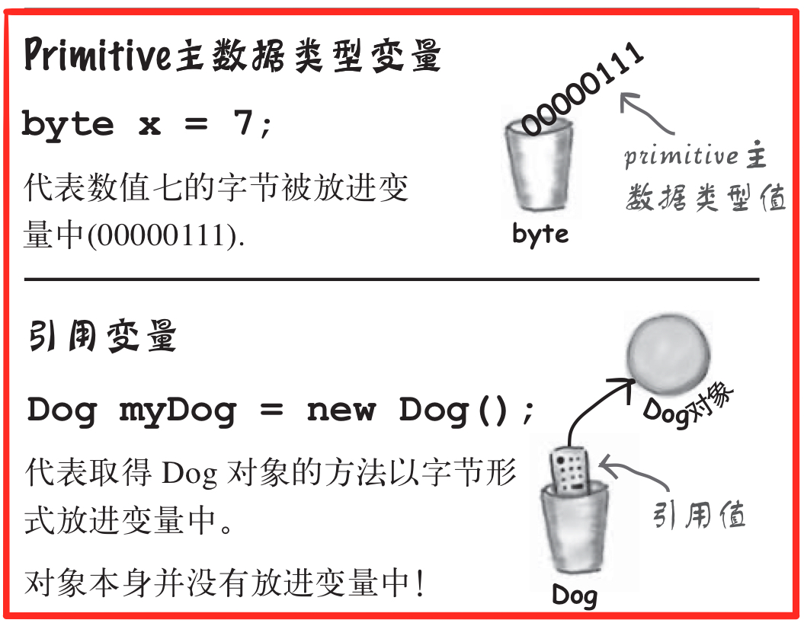

## 《Head First Java》读书笔记

### 1. 基本概念

* 源码`(.java)`由`javac`程序编译后生成代码`(.class)`，之后启动`Java`虚拟机`(JVM)`运行

* `Java`中的条件测试必须是`Boolean`值，不像`C++`中可以是整形。

* ```java
  public class BasicThree {
  	public static void main(String[] args) {
  		System.out.println(5+6+""+5+6);
  		System.out.println('A'+5+"hello");
  	}
  }
  // 输出：
  // 1156
  // 70hello
  ```

  1. 前面是单个字符(byte)的情况下，后面跟数字为加法运算符；
  2. 在遇到首个个字符之前，所有数遇`+`即`+`（单个字符`(byte)`的情况除外）；当遇到任意字符后，加号就变成了字符/字符串的拼接。

* `Java`是一个强类型语言，没有强制类型转化前,不允许两种不同类型的变量相互操作。

* 动态绑定：`Java`允许在执行期引用程序员没有预期到的类型。

* 编译器与虚拟机对比：

    编译器|虚拟机
    ---|---
    产生.class文件|执行文件
    检查数据类型、符号、违法调用private方法等|检查异常


### 2. 类与对象

* 对象被存放在可回收垃圾的堆上`(Gargage-Collectible Heap)`。

* 当某个对象被`JVM`察觉到不会再被使用，就会被标记为可回收的，当内存不够时，垃圾收集器会启动来清理垃圾、回收空间。
* 任何变量在加上`public`、`static`、`final`后，会变成全局变量取用的常熟


### 3. `primitive`主要数据和引用

#### 变量分为两种：

1. **`primitive`主要数据类型：**
   
   1. `boolean`：`true`或`false`
   2. `char`：0~65535
   3. `byte`：-128~128
   4. `short`：-32768~32767
   5. `int`： -2^{31} ~ 2^{31}-1 
   6. `long`： -2^{64} ~ 2^{64}-1 
   7. `float`：32bit，范围规模可变。注意，``float f = 1.2f``，要加上`f`，否则会被认为是`double`。
   8. `double`：64bit，范围规模可变
   
   小容量可以放进大容量的变量里，反之不行。
   
2. **引用：**

   * 所有的对象变量都是引用，真正的对象存放在堆中，变量里面存储的是指向对象的地址。

   * 对象在内存中的布局依次划分为3个区域：对象头(Header)，实例数据(Instance Data)以及对齐填充(Padding)。对齐填充是为了：使对象的大小必须是8字节的整数倍。

   * 所有的引用大小都一样。

     




#### 数组也是对象：

数组里可以放`primitive`主数据类型，也可以放对象引用。

```java
Dog[] dog = new Dog[10];	// Dog[] 是一个对象
for(int i=0;i<10;i++) {
    dog[0]=new Dog();	// 需要对每一个Dog应用变量进行赋值
}
```


### 4. 对象的行为

