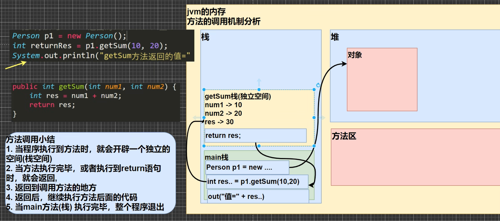
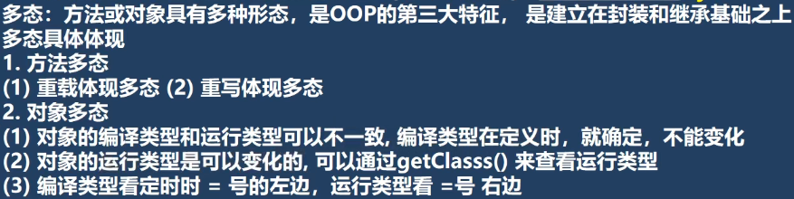
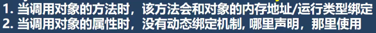
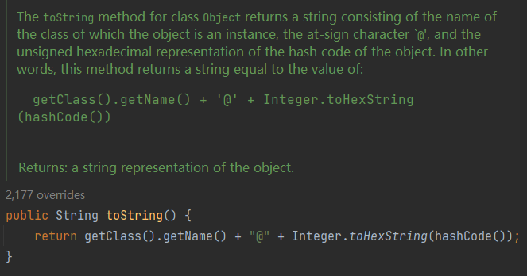
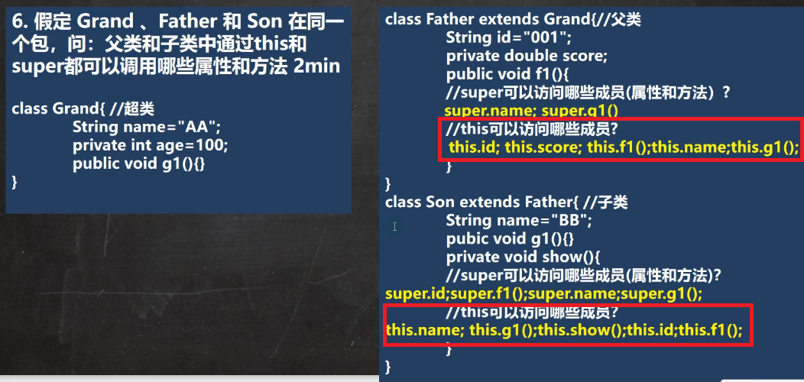

## 一、Java开发细节

### （一）注意事项

1. 一个源文件中最多只能有一个`public`类，且该类名称必须和文件一致。
2. 一个源文件中可以有多个非`public`的类，这些`java`类中均可以写`main`方法，用`javac`编译后会生成多个`class`文件，可以分别运行。


### （二）学习方法

#### 1. 需要学习的情况

1. 工作需要
2. 跳槽
3. 平时学新技术

#### 2. 要点

1. 用**传统技术考虑**是否能解决工作需要，若解决不了或不完美，再找新技术对比并解决。
2. 做好调研，要知道新技术**能够解决什么问题**，**改进**在哪，能带来什么**优势**？相应的**缺点**又是什么？
3. 学习新技术时，**不要去太钻研细节**，要先把**基本原理**和**语法**弄懂。
4. 用学到的基本原理实现个**快速入门的小项目**（如：增删改查），已经可以实现基本的工作需求了。
5. 最后，再研究**技术的细节、规范、如何优化**等（这部分是永无止境的）


### （三）Intellij Idea

#### 1. 快捷键

`file -> setting -> editor -> keymap`可查看/修改

| 快捷键                     | 功能                                                       |
| -------------------------- | ---------------------------------------------------------- |
| **Ctrl+Alt+L**             | **格式化**                                                 |
| Ctrl+Y                     | 删除当前行                                                 |
| Alt+Enter                  | 导入依赖包                                                 |
| **Ctrl+D**                 | **复制当前行**                                             |
| **Ctrl+F**                 | **查找**                                                   |
| **Ctrl+R**                 | **替换**                                                   |
| **Alt+Insert**             | **插入构造器等**                                           |
| **Ctrl+H**                 | **查看类结构**                                             |
| Ctrl+B或鼠标左键           | 定位类/方法/变量的定义处                                   |
| F7                         | 跳入（进入方法）                                           |
| F8                         | 跳过（执行语句，不进入方法）                               |
| shift+F8                   | 跳出（跳出方法）                                           |
| F9                         | 执行到下一个断点                                           |
| **选中代码段，Ctrl+Alt+T** | **添加`if-else`、`try-catch`、`while`等`Surround With`块** |
| **Ctrl+J**                 | **显示所有快捷键**                                         |


#### 2. 模板

`file -> setting -> editor -> Live templates`可查看/修改

| 类、变量             | 含义                                       |
| -------------------- | ------------------------------------------ |
| **main**             | **public static void main(String[] args)** |
| geti                 | public static <ClassName> getInstance()    |
| psf[i/s]             | public static final [int/String]           |
| prsf                 | private static final                       |
| lst                  | args[args.length - 1]                      |
| **new Object().var** | **自动创建变量名**                         |


| 输出     | 含义                                  |
| -------- | ------------------------------------- |
| **sout** | **System.out.println();**             |
| soutv    | System.out.println("args = " + args); |
| souf     | System.out.printf("");                |
| serr     | System.err.println();                 |

| 循环      | 含义                                                         |
| --------- | ------------------------------------------------------------ |
| **fori**  | **for(int i=0;i<;i++)**                                      |
| **大写i** | **增强版for循环：for(Object obj: )**                         |
| iter      | for (String arg : args)                                      |
| itar      | for (int i = 0; i < args.length; i++)                        |
| ritar     | for (int i = args.length - 1; i >= 0; i--) {                 |
| itli      | for (int i = 0; i < list.size(); i++)                        |
| itco      | for (Iterator iterator = collection.iterator(); iterator.hasNext(); ) |

| 其他     | 含义                    |
| -------- | ----------------------- |
| ifn      | if (args == null)       |
| inn      | if (args != null)       |
| mn       | = Math.min(, );         |
| mx       | = Math.max(, );         |
| toar     | .toArray(new Object[0]) |
| thr      | throw new               |
| **tryc** | **try...catch**         |
| trycf    | try...catch...finally   |
| RL       | .readLock().lock();     |
| WL       | .writeLock.lock();      |


---

## 二、Java基础

### （一）转义字符

| 字符 | 含义                                                     |
| ---- | -------------------------------------------------------- |
| `\t` | 制表符，实现`tab`对齐功能                                |
| `\n` | 换行符                                                   |
| `\r` | 回车符，回到行首（之后再输入内容会直接替换本行原有字符） |
| `\\` | `\`                                                      |
| `\"` | `"`                                                      |
| `\'` | `'`                                                      |


* `\r`和`\r\n`效果一致，都是换行
  


### （二）注释

* 单行注释：

  ```java
  // 注释文字
  ```

* 多行注释：

  ```java
  /*
  注释
  文字
  */
  ```

* 文档注释：

  ```java
  /**
  * @author WOC_BUG
  * @version 1.0
  */
  ```

  注释内容可以用`javadoc`工具生成说明文档：

  ```dash
  javadoc -d [路径] -[文档中加过的doc字段] [文件名].java
  ```

  例：

  

  


### （三）文档注释常用标签

| **标签**        |                         **描述**                         |
| :-------------- | :------------------------------------------------------: |
| `@author`       |                     标识一个类的作者                     |
| `@deprecated`   |                  指名一个过期的类或成员                  |
| `{@docRoot}`    |                 指明当前文档根目录的路径                 |
| `@exception`    |                   标志一个类抛出的异常                   |
| `{@inheritDoc}` |                   从直接父类继承的注释                   |
| `{@link}`       |                插入一个到另一个主题的链接                |
| `{@linkplain}`  |   插入一个到另一个主题的链接，但是该链接显示纯文本字体   |
| `@param`        |                    说明一个方法的参数                    |
| `@return`       |                      说明返回值类型                      |
| `@see`          |                指定一个到另一个主题的链接                |
| `@serial`       |                    说明一个序列化属性                    |
| `@serialData`   | 说明通过`writeObject() `和 `writeExternal()`方法写的数据 |
| `@serialField`  |             说明一个`ObjectStreamField`组件              |
| `@since`        |                标记当引入一个特定的变化时                |
| `@throws`       |                 和`@exception`标签一样.                  |
| `{@value}`      |         显示常量的值，该常量必须是`static`属性。         |
| `@version`      |                       指定类的版本                       |


### （四）DOS命令（Windows）

| 命令                                     | 含义                 |
| ---------------------------------------- | -------------------- |
| `dir`                                    | 目录                 |
| `tree`                                   | 目录树               |
| `cd`                                     | 切换目录             |
| `cd /D c:`                               | 从D盘切换至C盘根目录 |
| `d:/abc/text.txt` 或 `d:\\abc\\text.txt` | 绝对路径             |
| `../../text.txt `或 `..\\..\\text.txt`   | 相对路径             |
| `cls`                                    | 清屏(苍老师)         |
| `exit`                                   | 退出                 |
| `md`                                     | 创建目录             |
| `rm`                                     | 删除目录             |
| `copy`                                   | 拷贝文件             |
| `echo`                                   | 向文件输入内容       |
| `type`                                   | 创建文件             |
| `move`                                   | 剪切                 |


### （五）JDK、JRE、JVM的关系

**`JDK` = `JRE` + `java`开发工具**

**`JRE` = `JVM`+ `java`核心类库**


### （六）Java编写过程

1. 编写`Java`源码
2. `javac`编译成`.class`字节码文件
3. `java`运行，即将`.class`文件加载到`jvm`运行


---


## 三、Java变量

### （一）变量

| 基本数据类型 | 字节                      | 细节                       | 范围                        | 默认值         |
| ------------ | ------------------------- | -------------------------- | --------------------------- | -------------- |
| byte         | 1                         |                            | $-2^7$ ~  $2^7-1$           | (byte)0        |
| short        | 2                         |                            | $-2^{15}$ ~  $2^{15}-1$     | (short)0       |
| int          | 4                         |                            | $-2^{31}$ ~  $2^{31}-1$     | 0              |
| long         | 8                         | 数据后面**建议**加`l`或`L` | $-2^{63}$ ~  $2^{63}-1$     | 0L             |
| float        | 4（符号位+指数位+位数位） | 数据后面**必须**加`f`或`F` | $-3.403E38$ ~  $3.403E38$   | 0.0f           |
| double       | 8（符号位+指数位+位数位） | 注意比较/运算的精度问题    | $-1.798E308$ ~  $1.798E308$ | 0.0d           |
| char         | 2（Unicode编码）          |                            | $-2^{15}$ ~  $2^{15}-1$     | '\u0000'即null |
| boolean      | 1 或 4 （有待考证）       |                            | $0$、$1$                    | false          |

**全局变量（即属性）有默认值，而局部变量不会被自动初始化**

**全局变量和局部变量可以重名，访问时遵循就近原则**

```java
class Person{
    String name = "Bob";
    void setName(){
        String name = "Alice";
        System.out.println(name);
    }
}

// 输出：Alice
```


| 引用数据类型 | 字节 |
| ------------ | ---- |
| 类           |      |
| 接口         |      |
| 数组         |      |

#### +号的使用

* +号前后都是数值类型，做运算
* +号前后有字符类型，做拼接


#### 字符


#### Boolean

**`Java`中不能用`0`或非`0`的数字代表`true`或`false`**


### （二）类型转换

**从低精度到高精度能够自动转换：**

`char` -> `int` -> `long `->  `float` -> `double` 

`byte` -> `short` -> `int` -> `long `->  `float` -> `double` 


**为什么`long`能自动转换为`float`?**

`float`中有8位表示指数、23位表示尾数，范围是$2^{127}$（`127`是因为指数不能为负数）；

`long`的范围是$2^{64}$；

因此`float`范围远大于`long`。


1. **多种数据类型混合运算时，首先会转换成容量最大的数据类型**

   ```java
   int n1 = 10;
   float n2 = n1 + 1.1;	// 错误
   // 因为 1.1 是 double 类型， n1 会从 int 转换为 double ，n1 + 1.1 的结果是 double，无法自动转换成 float
   ```

2. **（`byte`，`short`）与`char`不能相互转换**

3. **`byte`、`short`、`char`三者可以运算，不管它们是单独运算还是混合运算，计算过程中都会首先转为`int`**

   单独运算：

   ```java
   byte b1 = 1;
   byte b2 = 2;
   byte b3 = b1 + b2;	// 错误
   // b1 + b2 会转为 int
   ```

   混合运算：


   ```java
    byte b1 = 1;
    short s1 = 1;
    short s2 = b1 + s1; 	// 错误
    // b1 + s1 首先会转为 int
   ```

4. **`boolean`不参与类型的自动转换**

5. <font color='red'>**`char`类型只能保存`int`类型的常量值，不能保存变量值**</font>

   ```java
   char c1 = 97;	// 正确
   int n1 = 97;
   char c2 = n1;	// 错误
   // int 的范围比 char 大
   ```

   

### （三）基本数据类型转换习题

#### 习题1


#### 习题2


字符相加得到的是其字符码值相加的和


### （四）String

#### 基本数据类型转String


#### String转基本数据类型


### （五）变量初始化顺序

**变量之间定义的先后顺序，决定了初始化顺序**

**即使变量定义分散在方法之间，他们仍然在任何方法（包括构造器）之前被初始化。**


---


## 四、运算符

### （一）算术运算符
#### 除法`/`

```java
System.out.println(10/4);	// 2
System.out.println(10.0/4);	// 2.5
System.out.println(10/4.0);	// 2.5

double ans = 10/4;	// 10/4得2，再转为double为2.0
System.out.println(ans);	// 2.0
```


#### 取模`%`

$a$ % $b$ = $a - a / b * b$

```java
System.out.println( 10 % 3 );	// 1
System.out.println( -10 % 3 );	// -1
System.out.println( 10 % -3 );	// 1
System.out.println( -10 % -3 );	// -1
// 符号随被除数的正负变化
```

当`a`是小数时：

$a$ % $b$ = $a - (int) a / b * b$

```java
System.out.println( -10.5 % 3 );	// -1.5
-10.5 - (int)(-10.5)/3*3
= -10.5 - (-10)/3*3
= -10.5 + 9
= -1.5
```


#### 自增`++`

`i = i++`

```java
int i = 1;
i = i++;
// ① tmp = i;
// ② i = i + 1;
// ③ return tmp;
// ④ i = tmp;
System.out.println(i);	// 1
```

`i = ++i`

```java
int i = 1;
i = ++i;
// ① i = i + 1;
// ② return i;
// ③ i = i;
System.out.println(i);	// 2
```


### （二）逻辑运算符

#### `&&`和`&`

* `a && b`：若`a`为假，则不会执行/判断`b`
* `a & b`：若`a`为假，依旧会执行和判断`b`

```java
int a = 10;
int b = 20;
if( a > 100 && ++b <100){
    System.out.println("true");
}
System.out.println("a = " + a + ",b = " + b);

// 输出：
// a = 10,b = 20
```

```java
int a = 10;
int b = 20;
if( a > 100 & ++b <100){
    System.out.println("true");
}
System.out.println("a = " + a + ",b = " + b);

// 输出：
// a = 10,b = 21
```

#### `||`和`|`

同理

* `a || b`：若`a`为真，则不会执行/判断`b`
* `a | b`：若`a`为真，依旧会执行和判断`b`

### （三）复合运算

#### `+=`、`++`等

**复合运算会自动强制类型转换**

```java
byte a = 4;
a += 2;	// 相当于 a = (byte)(a + 2)
a ++;	// 相当于 a = (byte)(a + 1)
// 而直接 a = a + 2才是错的，因为2是int类型
```


### （四）赋值运算符的结果

**注意：**赋值语句的结果并不是永真，而是要判断赋值操作后的结果值的

```java
boolean x = false, y = true;
if(x = true){	// 真
    // ...
}

if(y = false){	// 假
    // ...
}
```


### （五）运算符优先级


### （六）原码、反码、补码

1. $0$和正数的原码、反码、补码都是它本身
2. 负数的反码 = 其原码**符号位不变**，其它位取反 = 其补码 - 1 
3. 负数的补码 = 其反码 + 1
4. `java`中的数都是有符号的
5. **运算时要用补码运算，看结果要用源码看**


**例题1，求 `~-2`​：**

* $-2$原码：  10000000 00000000 00000000 00000010
* $-2$反码：  11111111 11111111 11111111 11111101
* $-2$补码：  11111111 11111111 11111111 11111110
* ~$-2$补码：00000000 00000000 00000000 00000001
* ~$-2$原码：00000000 00000000 00000000 00000001

答案：        $1$


**例题2，求`~2:`**

* $2$原码：  00000000 00000000 00000000 00000010
* $2$补码：  00000000 00000000 00000000 00000010
* ~$2$补码：11111111 11111111 11111111 11111101
* ~$2$原码：10000000 00000000 00000000 00000011

答案：     $-3$


**<font color='red'>注意：</font>**

* <font color='red'>符号位也参与位运算</font>
* <font color='red'>计算反码不包括符号位</font>


### （七）左移、右移、无符号右移

`<<`：符号位不变，低位补零

`>>`：符号位不变，低位溢出，并用符号位补溢出的高位

`>>>`：低位溢出，高位补零

**`char`、`byte`、`short`进行移位操作时，会先转成`int`，运算后再截断多余位**


**Q：**为什么`int`类型的数值在`>>32`时结果不为`0`？

**A：**

即，左移、右移操作最多只能移31位，超过之后的值的结果取决于不同的编译器


---


## 五、控制语句

### 标签

类似于`C`中的`goto`标签，但是收到限制，只能配合`continue`和`break`使用

```java
outer:	// 外层循环的标签
for(int i=0;i<3;i++){
    if(i==1)
    	continue outer;
    inter:	// 内层循环的标签
    for(int j=0;j<10;j++){
        if(j==2)
        	break inter;
        System.out.println("i="+i+",j="+j);
    }
}

/* 
输出：
i=0,j=0
i=0,j=1
i=2,j=0
i=2,j=1
*/
```


---


## 六、数组

### （一）基本概念

数组是一种数据类型，是引用**类型**

**定义方法：**

1. `int[] ans = {1,4,5,6,10};`

2. `int ans[] = {1,2,3,4,5};`
3. `int[] ans = new int[5];`

4. `int ans[]= new int[5];`


**java中可以用变量定义数组大小**

```java
int size = 100；
int[] num = new int[size];
```


### （二）值传递与引用传递

数组之间的赋值是引用赋值：

```java
int[] arr1 = {1,2,3};
int[] arr2 = arr1;
arr2[0] = 10;
// arr1的第0个元素也变成了10
```

* 基本数据类型保存的是值，即拷贝的是值

* 引用数据类型保存的是堆内的地址，即拷贝的是地址


### （三）数组扩容

```java
int[] arr = {1,2,3};
int[] arr2 = new int[arr.length+1];

// 赋值
for(int i=0;i<arr.length;i++){
    arr2[i] = arr[i];
}
arr2[3]=4;

// 拷贝引用
arr = arr2;
for(int i=0;i<arr.length;i++){
    System.out.println(arr[i]);
}

/*
输出：
1
2
3
4
*/
```


### （四）二维数组

#### 二维数组的内存形式


 

#### 赋值方式

1. `int[][] arr = {{1,1,1},{8,8,9},{100}};`

2. `int[][] arr = new int[2][3];`

3. `int[][] arr;`

   `arr = new int[2][3];`

4. ```java
   int[][] arr = new int[2][];	// 创建一个二维数组，里面放2个一位数组，但是每个一位数组还没有开数据空间
   for(int i=0;i<arr.length;i++){
       arr[i] = new int[i+1];	// 第二维容量可随意设置
   }
   ```


#### String数组

例题：


### （五）可变参数列表

```java
class Other{
	Other(String... str){	// 类似于传入一个String数组
		for(String i: str)
			System.out.print(i+" ");
		System.out.println();
	}
}
public class Index{
	public static void main(String[] args){
        Other other = new Object();	// 传入为空
		Other other2 = new Object("a","b","c");
		Other other3 = new Object(new String[]{"1","2","3"});	// 直接传入数组
		// Other other4 = new Object({"A","B","C"}); // 错误
	}
}
```

注意：可变参数列表只能作为最后一个参数定义，且同一个形参列表中最多只能出现一个可变参数。


### （六）枚举类型

```java
enum MyEnum{
    UP,DOWN,LEFT,RIGHT,MIDDLE
}
for(MyEnum myEnum: MyEnum.values()){
    System.out.println(myEnum+","+myEnum.ordinal());
}

/*
Output:
UP,0
DOWN,1
LEFT,2
RIGHT,3
MIDDLE,4
*/
```


**枚举可用于switch语句：**

```java
MyEnum middle = MyEnum.MIDDLE;
switch(middle){
    case LEFT:	// 标签必须为枚举类型的非限定名称，不能为MyEnum.LEFT
        System.out.println(MyEnum.LEFT);
        break;
    case RIGHT:
        System.out.println(MyEnum.RIGHT);
        break;
    case UP:
        System.out.println(MyEnum.UP);
        break;
    case DOWN:
        System.out.println(MyEnum.DOWN);
        break;
    case MIDDLE:
        System.out.println(MyEnum.MIDDLE);
        break;
}
```


---


## 七、类&对象

### （一）对象

#### 对象在内存中的存在形式


* 基本数据类型直接保存在堆中的对象中
* 常量、字符串类型保存在方法区的常量池中，而对象中保存的是指向常量池中数据的地址


#### 对象创建的流程

* 当创建对象，或首次访问静态域、静态方法时，会首先将类信息加载到方法区中，包括属性、行为。（**只加载一次**）
* 在堆中分配空间，清空空间，并初始化为默认值
* 将对象在堆中的地址，赋给指向它的引用
* 进行指定属性的初始化
* 执行构造器

（详见`《Think In Java》`95~96页  或 韩顺平`Java`视频199~200集）


##### 注意

* 访问静态常量不会初始化类：

  ```java
  class A{
      public final static String text = "hello world!";
      static {
          System.out.println("A");
      }
  }
  public class Test{
      System.out.println(A.text);
  }
  
  // 输出：hello world!
  // 静态代码块没有执行，说明没有初始化类
  // 若改成 public final static String text = new String("hello world!"); 则会初始化
  ```


#### 方法的调用机制




#### 方法传参

* 注意方法中都是值传递，因此传入的基本数据类型不会被真的改变，改变的是其拷贝。而传入的引用的拷贝能够指向同一块堆区间，从而真正地改变数据。


### （二）this


对象中隐藏着一个`this`，它的值是当前对象的地址。

`java`中可以通过`hashCode`来作为假地址查看，hashCode是根据对象的内部地址转换成的一个整数。


* `this`作为构造器使用时，只能放在第一句

  ```java
  class T{
      public T(){
          this("jack",23);
          // ... 其他语句
      }
      public T(String name,int age){
  	}
  }
  ```


### （三）final

* `static`、`final`共同修饰的常量是**编译时常量**（不包括`new`创建的对象）

  ```java
  class A{
      public final static String text = "hello world!";
      static {
          System.out.println("A");
      }
  }
  public class Test{
      System.out.println(A.text);
  }
  
  // 输出：hello world!
  // 静态代码块没有执行，说明没有初始化类，因为text在编译时就已经放在常量池中了
  // 若改成 public final static String text = new String("hello world!"); 则会初始化
  ```

* `final`修饰的引用类型不可改变指向的对象，但可以改变对象的属性。

* 没有在定义时初始化的`final`常量，必须在构造器中初始化。


### （四）访问权限修饰符

| 修饰符      | 本类 | 包内 | 子类 | 包外 |
| ----------- | ---- | ---- | ---- | ---- |
| `private`   | √    |      |      |      |
| `default`   | √    | √    |      |      |
| `protected` | √    | √    | √    |      |
| `public`    | √    | √    | √    | √    |

注意，只有`public`和`default`才能修饰类


### （五）向上转型

向上转型：父类引用指向子类对象

```java
class A{
    public void test(){
        System.out.println("A.test()");
    }
}
class B extends A{
    public void test(){
        System.out.println("B.test()");
    }
}

public class Main{
    public static void main(String args[]){
        A a = new B();
        a.test();
    }
}
// 输出 B.test
```

* 向上转型调用方法必要条件：继承+方法覆盖
* 若上例中的方法是`private`，子类B就无法覆盖A的方法，因此向上转型后也无法使用该方法


### （六）向下转型

接上例：

```java
A a = new B();
B b = (B)a;	// 向下转型为强制转换

// 错误
// A a = new A();
// B b = (B)a;
```

**只有父类引用的子类对象才能向下转型，直接父类对象不能向下转型。**


---


## 八、封装、继承、多态

### （一）封装

将属性和方法封装在类中，隐藏具体的实现细节，只提供对外的接口。


### （二）继承

* `private`方法不能被覆盖，因此在向上转型时无法调用

  

* 创建子类对象时，不管使用哪个子类构造器，都会默认调用父类的无参构造器。如果没有，则必须在子类构造器中使用`super`指定，否则编译不通过。

#### 继承内存情况


类信息保存在方法区，对象中会保存有其父类的属性


#### 对象访问属性/方法顺序


直接访问属性和在属性前加`this`访问的效果、查找顺序都是一致的

详见：[韩顺平Java_继承本质详解](https://www.bilibili.com/video/BV1fh411y7R8?p=294)


#### 例题

**代码：**

```java
// A类
public class A {
    public A() {
        System.out.println("A()");	// 4
    }

    public A(String name) {
        System.out.println("A: " + name);
    }
}

// B类
public class B extends A{
    public B(){
        this("Alice");	// 2
        System.out.println("B()");	// 6
    }

    public B(String name){	// 3
        System.out.println("B: "+name);	// 5
    }
}

// main所在类
public class ExtendExercise {
    public static void main(String[] args) {
        A obj = new B();	// 1
    }
}
```

**执行顺序：**

1. 进入`B()`，发现有个`this("Alice")`，于是进入`B(String name)`。
2. 而`B(String name)`会有默认的`super`指向父类的无参构造器，于是进入`A()`。
3. `A()`执行结束后，继续执行`B(String name)`，随后再回到`B()`。

**输出结果：**

```java
// A()
// B: Alice
// B()
```


#### super

`super`和`this`都只能放在构造器的第一行，因此他们不能共存。


#### Override

* 子类的方法签名必须和父类一致
* 子类的返回值必须为父类返回值或其子类
* **子类方法不缩小父类方法的访问权限**


**override与overload区别**


**代码复用**


### （三）多态（Polymorphic）

方法或对象具有多种形态。




#### 静态多态

* 重载(Overload)：方法签名不一样（方法签名 = 方法名 + 参数列表）

```java
public class Animal {
    public void eat() { }
    
    public void eat(String name) { }
}
```


#### 动态多态

* 父类引用指向子类对象

* 重写（Override）

  属性不支持重写（包括引用类型的属性），因为属性在编译时已经确定，因此无法动态查找子类属性

  ```java
  // Animal基类
  public class Animal {
      int age = 10;
      Food food = new Fish();	// Food基类，Fish子类，里面只有一个String属性
  
      public void eat(){
          System.out.println("Animal eat()");
      }
  }
  
  // Cat子类
  public class Cat extends Animal{
      int age = 7;
      Food food = new Fish();
  
      @Override
      public void eat(){
          System.out.println("Cat eat()");
      }
  }
  
  public class Index {
      public static void main(String[] args) {
          Animal animal = new Cat();
          System.out.println(animal.age); // 10
          System.out.println(animal.food.name);	// Food
      }
  }
  ```


如果`A`类继承`B`类，`B`继承`C`，先定义`C obj = new A()`，在调用方法时仍然遵循从子类（运行类型）找起的规则。如果子类`A`找不到可以调用的方法/属性，则继续向上找其父类`B`。


#### 多态的向下转型

* [子类类型] [引用名] = (子类类型)父类引用

* 只能强制转换父类的引用，不能强转父类对象

* 且要求父类引用在编译时本来就指向该子类对象

  ```java
  // 可以
  Animail animal = new Cat();
  Cat cat = (Cat)animal;
  
  // 错误
  Animail animal = new Cat();
  Dog dog = (Dog)animal;
  ```

* 对象多态时，无法调用基类没有的方法，如果要调用，可以进行向下转型

  ```java
  class A{ }
  class B extends A{
      void fun(){ }
  }
  
  class Main(){
      public static void main(String[] args){
          A a = new B();
          if(a instanceof B){
              ((B)a).fun();	// 强制转为B类型
          }
      }
  }
  ```

  

#### 编译类型与运行类型

等号坐标为编译类型，等号右边为运行类型。编译类型不可变，运行类型可变。


##### instanceof

判断的是对象的**运行类型**是否为某个类型/某类型的子类型

```java
// Cat 继承 Animal 类
Animal animal = new Cat();

if(animal instanceof Animal){
    System.out.println("animal 是 Animal类型");	// 输出
}
if(animal instanceof Cat){
    System.out.println("animal 是 Cat");	// 输出
}
```


### （四）java的动态绑定机制【重点】

[视频教程](https://www.bilibili.com/video/BV1fh411y7R8?p=315&spm_id_from=pageDriver)



* 子类的属性无法被父类引用直接访问到，因为属性是编译时就确定好的。但是，可以使用`get`方法获取属性，从而实现访问子类属性的需要。

**例一：**

```java
class A{
    int num = 10;
}
class B extends A{
    int num = 20;
}
class Index{
    public static void main(String[] args){
        A a = new B();
        System.out.println(a.num);	// 输出 10
    }
}
```

改进：

```java
class A{
    int num = 10;
    int getNum(){
        return num;
    }
}
class B extends A{
    int num = 20;
    int getNum(){
        return num;	// 使用动态绑定的方法可以访问到当前类的属性
    }
}
class Index{
    public static void main(String[] args){
        A a = new B();
        System.out.println(a.getNum());	// 输出 20
    }
}
```


**例二：**

通过多态实现的对象，在访问方法时，优先访问动态绑定的类，如果找不到再找其父类方法。

```java
class A {
    int num = 10;
    int getNum() {
        return num;
    }
    int cal(){
        return getNum() * 10;
    }
}
class B extends A {
    int num = 20;
    int getNum() {
        return num;
    }
    int cal(){
        return getNum() + 10;
    }
}
class C extends B {
    int num = 30;
    int getNum() {
        return num;
    }
}
class Index {
    public static void main(String[] args){
        A c = new C();
        System.out.println(c.cal());	// 输出 40 （B.cal() => C.getNum() + 10）
    }
}
// 如果B类也没有cal方法，则输出 300 (A.cal() => C.getNum() * 10 => 300)
// 如果C类没有getNum方法、B类没有cal方法，则输出 200 (A.cal() => B.getNum() * 10 => 200)
```


---


## 九、Object

### （一）equals()

`equals`和`==`区别：

  | 概念 | 基本数据类型 | 引用类型
---|---|---|---
`==` | 比较运算符 | 可以使用 | 可以使用，比较的是地址是否相等 
`equals()` | `Object`方法 | 不可使用 | 可以使用，默认用`==`实现，若要比较内容相等需要进行重写 


**equals()重写样例：**

```java
public boolean equals(Object obj){
    if(this == obj)
        return true;
    if(obj instanceof [类型]){	// obj是否为[类型]或者其子类
    	// ... 具体属性比较
    }
    else{
        return false;
    }
}
```


### （二）toString()

* 默认返回【全类名@对象哈希值的十六进制】

  

* 直接输出对象时，`toString`方法会被默认调用


### （三）finalize()

* 对象被回收时系统自动调用
* 注意，垃圾回收的时间由系统自己决定，即使手动调用`System.gc()`也不一定会执行


### （四）例题

#### 例1：




#### 例2：

`Student`继承`Person`

```java
// 父类
public class Person {
    public void run(){
        System.out.println("Person run()");
    }

    public void eat(){
        System.out.println("Person eat()");
    }
}

// 子类
public class Student extends Person{
    @Override
    public void run() {
        System.out.println("Student run()");
    }

    public void study(){
        System.out.println("Student study()");
    }
}

// main()所在入口
public class Index {
    public static void main(String[] args) {
        
        // p不能访问study()，因为只有运行时才能动态绑定，编译时只能看到Person类型
        Person p = new Student();
        p.run();    // Student
        p.eat();    // Person

        System.out.println("====================");

        Student s = (Student) p;
        s.run();    // Student
        s.study();  // Student
        s.eat();    // Person

    }
}
```

**由父类`Person`引用指向子类`Student`对象，在编译时无法确认其子类类型，因此只能访问到父类`Person`拥有的方法`run()`和`eat()`；而运行后存在动态绑定机制，因此执行了子类的`run()`方法。**


#### 例3：

继承中构造方法的执行顺序

``` java
// A类
public class A {
    public A() {	// 6
        System.out.println("A类");	// 7
    }
}

// B类
public class B extends A {
    public B() {
        System.out.println("B类");
    }

    public B(String name) {	// 5
        System.out.println(name + ",B类有参构造");	// 8
    }
}

// C类
public class C extends B{
    public C() {	// 1
        this("hello");	// 2
        System.out.println("C类");	// 10
    }

    public C(String name) {	// 3
        super("haha");	// 4
        System.out.println("C类有参构造");	// 9
    }
}


/*
main方法中执行 C c = new C() ,输出为：

A类
haha,B类有参构造
C类有参构造
C类

*/
```


## 十、static

**应用：单例模式**

### （一）static变量

* 同一个类的所有对象共享`static`变量
* 类加载时生成`static`变量
* 通过对象名和类名均可访问

### （二）static方法

* 当方法中不涉及任何实例对象时，适合使用`static`修饰，如各种工具类
* `static`方法中只能访问静态变量或静态方法，不能出现和对象有关的关键词`super`、`this`等；非静态方法都可以访问。

### （三）main方法

`public static void main(String[] args){}`

* 由`java`虚拟机调用

* 由于`java`虚拟机和`main`所在类不在同一个类和包，因此要声明为`public`

* `String[] args`为执行程序时传入的参数列表

  ```java
  public class Hello{
      public static void main(String[] args){
          for(String i: args){
              System.out.println(i);
          }
      }
  }
  
  // 执行：
  // javac Hello.java
  // java Hello A B C
  
  // 输出:
  // A
  // B
  // C
  ```

  （`idea`中可以通过右上角`Edit Configuration`设置传入参数）


## 十一、代码块/初始化块

### （一）普通代码块

```java
{
	// 代码...
};
```

（分号可加可不加）

* 如果多个构造函数中都有重复的语句，则可以把它们抽离到初始化块中
* **初始化块的调用顺序优先于构造器**
* 普通代码块在对象创建时调用，创建一次就调用一次，访问类的静态成员不会执行它


### （二）静态代码块

```java
static{
    <代码>
};
```

* **静态代码块在类加载的时候执行，且只会被执行一次**
* 静态代码块只能调用静态成员变量和方法


### （三）类加载的时机

1. 创建当前类的对象时
2. 创建子类对象时，父类先被加载，其次是子类
3. 访问类的静态变量、方法时

**类加载只会执行一次**


### （四）代码调用顺序

#### 1. 普通类中的调用顺序

1. 静态变量和静态代码块
2. 普通变量和普通代码块
3. 构造器

**（静态）变量和（静态）代码块的执行顺序，与代码书写的顺序一致。在（静态）代码块中可以使用（静态）变量，但是它必须在（静态）代码块前声明。**


#### 2. 存在继承关系的代码调用顺序

1. 父类静态变量和静态代码块
2. 子类静态变量和静态代码块
3. 父类普通变量和普通代码块
4. 父类构造器
5. 子类普通变量和普通代码块
6. 子类构造器


之所以是这种顺序，是因为**构造器的开头其实隐藏了`super()`和普通代码块的调用：**

```java
class A{
    public A(){
        // super();		1
        // 调用普通代码块		2
        System.out.println("ok")	// 3
    }
}
```


### 十二、final

**适用范围：**

1. 不希望某个类被继承
2. 不希望某个方法被子类重写（覆盖）
3. 不希望某个属性（成员变量）被修改
4. 不希望某个局部变量被修改


**注意**

1. `final`修饰的属性必须赋初值：定义时、构造器（静态属性除外）、普通/静态初始化块中。

2. `final`类没必要在写`final`方法

3. `final`不能修饰构造器

4. **`final`往往和`static`配合使用，底层编译器做出了优化处理，不会导致类加载，会更快。**

   ```java
   public class A{
       public final static int n = 10;
       static{
           System.out.println("静态初始化块！");
       }
   }
   
   // 调用A.n，没有任何输出
   ```