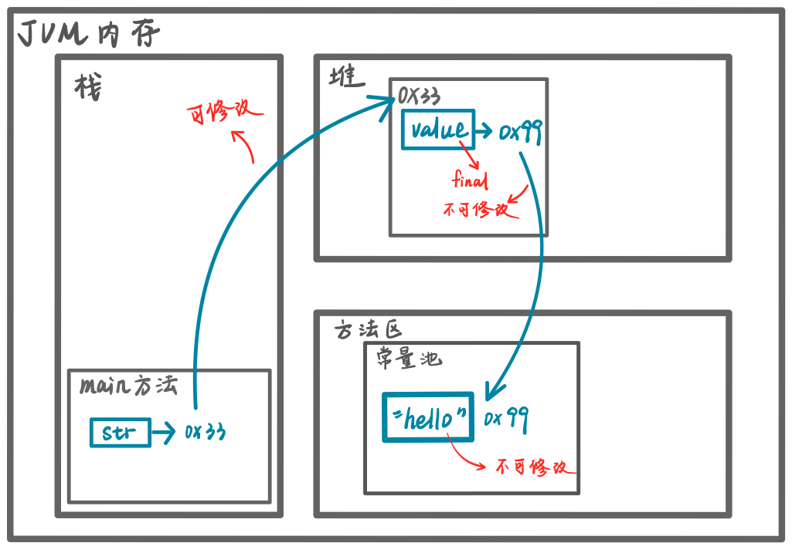
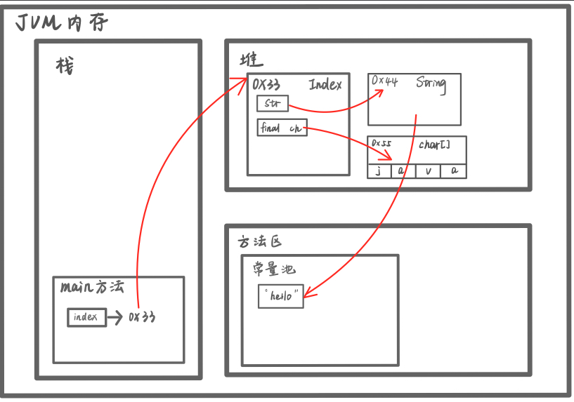
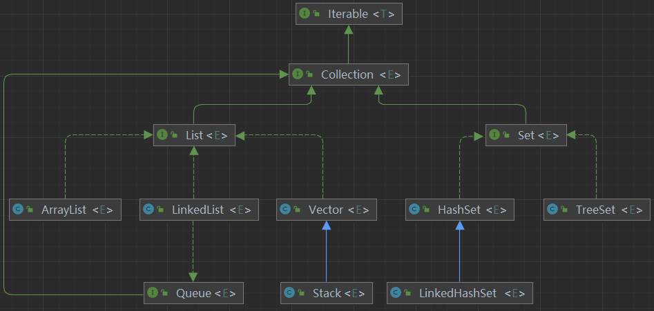

## 一、工具

`javac` 编译工具

`javap` 反编译工具(从`class` 文件得到`java`文件)：


## 二、抽象

当父类方法不确定具体实现内容时，可以定义其为抽象方法。

```java
public abstract class Animal{
    public abstract void eat();
}
```

**注意：**

1. 包含抽象方法的类，必须声明为抽象类；
2. 抽象方法没有方法体；
3. 抽象类可以没有抽象方法；
4. `abstract`只能修饰类和方法；
5. 继承了抽象类的子类，必须实现其父类的所有抽象方法，除非它自己也声明为抽象类；
6. **抽象方法不能使用`private`、`final`、`static`，因为加了这三个关键字的方法无法被重写。**


**应用：模板方法模式**


## 三、接口

### （一）基本概念

实现接口是对`java`单继承机制的补充，继承是满足`is-a`的关系，实现接口是满足`like-a`的关系。

* `Jdk7`之前，接口中的所有方法都没有方法体；

* `Jdk8`之后，接口中可以有静态方法、默认方法（`default`修饰）；

* 接口中的抽象方法可以不加`abstract`关键字；

* 一个类可以实现多个接口；

* 接口不能继承类，只能**继承**其他接口，注意是`extends`关键字；

  ```java
  interface A{}
  interface B{}
  interface C extends A,B {}
  ```

* 接口中的所有方法都是`public`的；

* 接口本身只能是`public`或默认的；

* 接口中的属性实际上隐藏了`static final`修饰符，因此必须初始化；

  ```java
  interface A{
  	int n = 10; // 等价于public static final n = 10;
  }
  ```

* 实现了接口的抽象类，可以不实现接口中的方法；

* **接口在一定程度上实现代码的接口**。


### （二）接口的多态特性

#### 1. 多态参数

```java
interface Usb {
    public void start();
    public void end();
}

class Camera implements Usb {
    @Override
    public void start(){
        System.out.println("相机开始工作");
    }
    
    @Override
    public void stop(){
        System.out.println("相机停止工作");
    }
}

class Phone implements Usb {
    @Override
    public void start(){
        System.out.println("手机开始工作");
    }
    
    @Override
    public void stop(){
        System.out.println("手机停止工作");
    }
}

class Computer {
    public void work(Usb usb) {	// 传入接口
        usb.start();
        usb.stop();
    }
}
```


#### 2. 多态数组

```java
interface Usb{}
class Camera implements Usb{}
class Phone implements Usb{
    public void call(){
        System.out.println("打电话...")
    }
}

public class Index{
    public static void main(String[] args) {
        Usb[] usbs = new Usb[2];
        usbs[0] = new Phone();
        usbs[1] = new Camera();
        
        for(Usb i: usbs){
            if(i instanceof Phone){
                ((Phone)i).call(); // 向下转型
            }
        }
    }
}
```


#### 3. 接口的多态传递现象

```java
interface IA { 
    void hi();
}
interface IB extends IA { }
class C implements IB {
	@Override
    public void hi() { }
}

public class Index{
    public static void main(String[] args) {
        IA a = new C();
        a.hi();
    }
}
```


### （三）继承与接口

**继承与接口同时使用时，相同的属性必须明确其含义**

```java
interface A {
    int x = 10;
}

class B{
    int x = 20;
}

class C extends B implements A{
    public void printX(){
        // System.out.println(x);  // x is ambiguous
        System.out.println(A.x);
        System.out.println(super.x);
    }
}
```


## 四、内部类

**类的五大成员：属性、方法、构造器、初始化块、内部类**

```java
class OuterOther{	// 外部其他类
    
}
class Outer{	// 外部类
    int n = 10; // 属性
    Outer() {	// 构造器
        
    }
    {
        // 初始化块
    }
    int getN(){	// 方法
        return n;
    }
    class Inner{	// 内部类
    }
}
```


### （一）局部内部类

``` java
class OuterOther{
    // 5. 无法访问Inner
}
class Outer{
    private int n = 10;
    private void m1() {}
    
    public void m2() {
        final class Inner{	// 3. 作用域仅在m2()中
            int n = 20;	// 6. 变量n重名
            public void f1(){
                // 1. 直接访问外部类的所有成员
                m1();                
                
                System.out.println(n);	// 6. 就近原则，输出20
                System.out.println(this.n);	// 内部类的n
                System.out.println(Outer.this.n);	// 6. 外部类的n，this为调用m2()的对象
            }
        }
    }
    
    {
        class Inner{	// 作用域仅在初始化块中
            public void f1(){
        		m1();
            }
        }
    }
    
    Inner inner = new Inner(); // 4. 外部类通过创建实例访问
}
```


1. 能直接访问外部类的所有成员，包括私有属性；
2. 不能添加访问修饰符，因为它相当于一个局部变量，`final`、`abstract`等可以添加；
3. 作用域仅在方法/代码块中；
4. 外部类通过创建内部类的实例调用方法；
5. 外部其它类，不能访问局部内部类（因为它相当于一个局部变量）；
6. 外部类和局部内部类的成员重名时，遵循就近原则，若想访问外部类的成员，可以使用`外部类名.this.成员`去访问；


### （二）匿名内部类

``` java
class Outer {
    private int n = 10;

    public void method() {
        // 编译类型：IA
        // 运行类型：匿名内部类（底层会分配一个类名Outer$1）
        IA tiger = new IA() {
            @Override
            public void cry() {
                System.out.println("虎啸...");
            }
        };
        tiger.cry();
        
        // 编译类型：Father
        // 运行类型：匿名内部类（底层会分配一个类名Outer$2）
        Father father = new Father("Jack"){
            @Override
            public void test(){
                System.out.println("匿名内部类重写test()");
            }
        }
        father.test();
    }
}

interface IA {
    public void cry();
}

class Father{
    Father(String name){ }
    public void test(){
        
    }
}
```


1. 能直接访问外部类的所有成员，包括私有的；

2. 不能添加访问修饰符，因为它相当于一个局部变量，`final`可以添加；

3. 作用域仅在方法/代码块中；

4. 本质是类，同时还是一个对象；

   ```java
   // 接上例，也可以直接调用方法
   new Father("Jack"){
       @Override
       public void test(){
           System.out.println("匿名内部类重写test()");
       }
   }.test();
   ```

5. `jdk`底层会给匿名内部类分配名字：外部类名$编号；

6. 匿名内部类只能使用一次（注意，不是说匿名内部类的对象）；

7. 外部其它类，不能访问匿名内部类（因为它相当于一个局部变量）；

8. 外部类和匿名内部类的成员重名时，遵循就近原则，若想访问外部类的成员，可以使用`外部类名.this.成员`去访问；

9. 不能重写构造器。


### （三）成员内部类

```java
class Outer{
    private int n = 10;

    private class Inner{
      void fun(){
          System.out.println(n);
      }
    };

    public void printInnerFun(){
        Inner inner = new Inner();
        inner.fun();
    }
}
```


1. 能直接访问外部类的所有成员，包括私有的；

2. 本质是类，同时也是属性；因此，**可以加访问修饰符，作用域为整个类体**；

3. 外部类访问成员内部类，可以通过创建对象；

4. 外部其他类访问成员内部类：

   ```java
   // 1. 通过外部类创建对象
   Outer outer = new Outer();
   Outer.Inner inner = outer.new Inner();
   
   // 2. 在外部类中编写方法，返回内部类对象
   class Outer{
       // ...
       public Inner getInner(){
       	return new Inner();
   	}
       // ...
   }
   ```

5. 外部类和成员内部类的成员重名时，遵循就近原则，若想访问外部类的成员，可以使用`外部类名.this.成员`去访问。


### （四）静态内部类


1. 可以访问外部类的所有静态成员，包括私有的；

2. 本质是类，同时也是静态属性；因此，**可以加访问修饰符，作用域为整个类体**；

3. 外部类访问静态内部类，可以通过创建对象；

4. 外部其他类访问静态内部类：

   ```java
   // 1. 通过类名直接访问
   Outer.Inner inner = new Outer.Inner();
   
   //  2. 在外部类中编写方法，返回内部类对象
   class Outer{
       // ...
       public Inner getInner(){
       	return new Inner();
   	}
       public static Inner getInner_(){
       	return new Inner();
   	}
       // ...
   }
   ```

5. 外部类和成员内部类的成员重名时，遵循就近原则，若想访问外部类的成员，可以使用`外部类名.成员`去访问。


## 五、枚举

1. 一组有限常量的集合
2. 不能修改


### （一）自定义枚举

```java
class Season{
    private String name;
    private String detail;

    // 固定几个public static对象
    // 加入final修饰符优化
    public static final Season SPRING = new Season("春天","花");
    public static final Season SUMMER = new Season("夏天","西瓜");
    public static final Season AUTUMN = new Season("秋天","枫叶");
    public static final Season WINTER = new Season("冬天","雪");

    // 私有化构造器，避免多余的对象产生
    private Season(String name,String detail){
        this.name = name;
        this.detail = detail;
    }

    // 去除set方法，避免修改属性
    public String getName() {
        return name;
    }

    public String getDetail() {
        return detail;
    }
}
```


### （二）enum关键字实现

```java
enum Season{

    // 必须写在最前面，且必须用逗号隔开
    SPRING("春天","温暖"),
    SUMMER("夏天","西瓜"),
    AUTUMN("秋天","凉爽"),
    WINTER("冬天","雪");

    private String name;
    private String detail;

    // 私有化构造器，避免多余的对象产生
    private Season(String name,String detail){
        this.name = name;
        this.detail = detail;
    }

    // 去除set方法，避免修改属性
    public String getName() {
        return name;
    }

    public String getDetail() {
        return detail;
    }
}
```

如果是无参构造可以简写为：

```java
// 无参构造的四个Season对象
enum Season{
    SPRING,SUMMER,AUTUMN,WINTER;
}
```


**例题：**

```java
enum Gender{
    BOY,GIRL;
}

// enum 类的 toString() 方法返回的是枚举项的 name
System.out.println(Gender.BOY);	// 输出BOY
```


### （三）常用方法


```java
Season autumn = Season.AUTUMN;
Season summer = Season.SUMMER;

System.out.println(autumn.ordinal());	// 输出2，下标从0开始
System.out.println(autumn.name());	// 输出AUTUMN
Season[] values = autumn.values();	//返回所有枚举项
Season autumn2 = Season.valueOf("AUTUMN");	// 按名称返回对应枚举项，autumn2和autumn是同一个对象
System.out.println(summer.compareTo(autumn));	// 输出-1，是两个的序号相减的结果
```


**注意：`enum`有隐式继承`Enum`类，因此不能继承其他类，但是可以实现接口。**


## 六、注解（Annotation）

又称为元数据(`Metadata`)

### （一）@Override

用于重写父类方法

```java
@Target(ElementType.METHOD)	// 限制注解使用在哪些元素上
@Retention(RetentionPolicy.SOURCE)	// 限制注解只保留在源文件，其他选项有:CLASS、RUNTIME
public @interface Override {	// @interface表示是注解，不是接口
}
```

`Target`和`Retention`是修饰注解的注解，称为元注解。


### （二）@Deprecated

* 表示某个元素（类、方法等）已过时，不推荐使用
* 可以用于版本升级时的过渡

```java
@Documented	// 表示该注解应当被javadoc工具记录
@Retention(RetentionPolicy.RUNTIME)
@Target(value={CONSTRUCTOR, FIELD, LOCAL_VARIABLE, METHOD, PACKAGE, MODULE, PARAMETER, TYPE})
public @interface Deprecated {
    /**
     * Returns the version in which the annotated element became deprecated.
     * The version string is in the same format and namespace as the value of
     * the {@code @since} javadoc tag. The default value is the empty
     * string.
     *
     * @return the version string
     * @since 9
     */
    String since() default "";

    /**
     * Indicates whether the annotated element is subject to removal in a
     * future version. The default value is {@code false}.
     *
     * @return whether the element is subject to removal
     * @since 9
     */
    boolean forRemoval() default false;
}
```


### （三）@SuppressWarning

抑制（不显示）编译器警告

常用警告类型：

1. `unchecked`未检查的警告
2. `rawtypes`没有指定泛型的警告
3. `unused`没有使用某个变量的警告
4. `all`所有警告

点击左侧黄色提醒，即可快速添加`SupressWarning`

```java
@Target({TYPE, FIELD, METHOD, PARAMETER, CONSTRUCTOR, LOCAL_VARIABLE, MODULE})
@Retention(RetentionPolicy.SOURCE)
public @interface SuppressWarnings {
    /**
     * The set of warnings that are to be suppressed by the compiler in the
     * annotated element.  Duplicate names are permitted.  The second and
     * successive occurrences of a name are ignored.  The presence of
     * unrecognized warning names is <i>not</i> an error: Compilers must
     * ignore any warning names they do not recognize.  They are, however,
     * free to emit a warning if an annotation contains an unrecognized
     * warning name.
     *
     * <p> The string {@code "unchecked"} is used to suppress
     * unchecked warnings. Compiler vendors should document the
     * additional warning names they support in conjunction with this
     * annotation type. They are encouraged to cooperate to ensure
     * that the same names work across multiple compilers.
     * @return the set of warnings to be suppressed
     */
    String[] value();
}
```


### （四）元注解

#### 1. Retention

用于指定注解可以保留的时长

参数：

1)` RetentionPolicy.SOURCE`：注解只保留在源文件中

2) `RetentionPolicy.CLASS`：注解保留到编译后，记录在`class`文件中

3) `RetentionPolicy.RUNTIME`：注解保留到运行时，程序可以通过反射获取该注解

#### 2. Target

指定能够修饰的程序元素：类、方法、局部变量、属性、构造器、参数、包、模块等

#### 3. Documented

指定当前注解能被`javadoc`提取成文档

#### 4. Inherited

被修饰的注解将具有继承性，若某个类的注解被`Inherited`修饰，则它的子类自动具有该注解


## <font color='red'>七、异常</font>

### （一）try-catch

```java
try {
	// 可能出错的代码块
} catch(NullPointerException e) { // 异常发生时会直接进入catch块，不执行异常后面的代码；若没有异常则不会进入
    System.out.println(e.getMessage());
} catch(ArithmeticException e) {
    System.out.println(e.getMessage());
}catch(Exception e) {	// 子类异常要写在父类异常前面
	e.printStackTrace();
    System.out.println(e.getMessage());
} finally {
    // 不管有没有发生异常，必定执行的代码
}
```


`catch`也可以不写：

```java
try{
    int n1 = 10;
    int n2 = 0;
    System.out.println(n1 / n2);
} finally {
    System.out.println("finally");
}
System.out.println("程序继续执行");

/*
输出：
finally
*/
```

虽然`finally`执行了，但是没有捕获异常，不会输出后面的内容。


### （二）异常分类

$$ 异常\left\{ \begin{aligned} Error \\ Exception \end{aligned} \right. $$

#### 1. Error

`Java`虚拟机无法解决的严重错误，会导致程序崩溃：`JVM`系统内部错误、资源耗尽等。

$$ Error\left\{ \begin{aligned} StackOverFlow \\ OutOfMemory \end{aligned} \right. $$

#### 2. Exception

其他编程错误，或偶然的外在因素导致的一般性问题：空指针访问、读取不存在的文件、网络中断等。

$$ Exception \left\{ \begin{aligned} 1) 运行时异常（默认throws抛给父类，直到JVM） \\ 2) 编译时异常（必须用try-catch或throws处理） \end{aligned} \right. $$


$$ 1) 运行时异常\left\{ \begin{aligned} NullPointerException （空指针异常） \\ ClassCastException （类型转换异常） \\ NumberFormatException （数字格式异常） \\ ArrayIndexOutOfBoundsException （数组越界异常） \\ ArithmeticException（算术运算异常） \end{aligned} \right. $$


$$ 2) 编译时异常 \left\{ \begin{aligned} FileNotFoundException （找不到文件异常） \\ ClassNotFoundException （找不到类异常） \\ IOException （文件异常） \\ SQLException （数据库异常） \\ EOFException （操作文件到文件末尾） \\ IllegalArgumentException （参数异常） \end{aligned} \right. $$


### （三）异常体系图


### （四）throws

* 将错误抛出给调用自己的方法，直到抛给`JVM`（若程序员没有显示地处理异常，默认使用`throws`）
* `throws`可以抛出一系列异常
* `throws`抛出的异常可以是发生异常的父类


1. 子类重写父类方法时，抛出的异常必须是**父类异常**或**父类异常的子类**；
2. `try-catch`和`throws`二选一，有了`try-catch`可以不必写`throws`;
3. 注意，子类抛出的编译时异常，父类一定要处理或继续抛出，而运行异常不用，因为有默认处理机制。

区别|定义|位置|后面跟的东西
---|---|---|---
throws|异常处理的方式|方法签名后|异常类型
throw|生成异常对象|方法体中|异常对象


### （五）自定义异常

```java
public class Index {
    public static void main(String[] args) {
        int age = 150;
        if(!(age>=0 && age <= 120)){
            throw new AgeException("年龄需要在0到120岁之间！");
        }
        System.out.println("年龄正确！");
    }
}

class AgeException extends RuntimeException {
    AgeException(String message){
        super(message);
    }
}
```

抛出效果：


注意，自定义异常一般都继承`RuntimeException`，如果继承编译时异常还要手动抛出，比较麻烦。


### （六）异常例题

例一：

```java
try {
    String[] arr = new String[3];	// 1
    if (arr[1].equals("hello")) {	// 2
        System.out.println(arr[1]);
    } else {
        arr[3] = "world";
    }
    return 1;
} catch (ArrayIndexOutOfBoundsException e){
    return 2;
} catch (NullPointerException e){	// 3
    return 3;	// 4
} finally {	// 5
    return 4;	// 6
}

// 返回4
```


例二：

```java
int i = 1;
try {
    i++;
    String[] arr = new String[3];
    if (arr[1].equals("hello")) {
        System.out.println(arr[1]);
    } else {
        arr[3] = "world";
    }
    return i;
} catch (ArrayIndexOutOfBoundsException e) {
    return i;
} catch (NullPointerException e) {
    return ++i;     // 临时保存i的值：int tmp = i;
} finally {
    ++i;
    System.out.println("i = " + i); // i = 4
}

// 输出i = 4，返回3
```


例三：

```java
public static void main(String[] args) {
    try {
        func();
        System.out.println("A");
    }catch (Exception e){
        System.out.println("C");
    }
    System.out.println("D");
}

public static void func(){
    try {
        throw new RuntimeException();
    } finally {
        System.out.println("B");
    }
}

/* 输出：
B
C
D
*/
```


习题：

让用户输入一个整数，如果输入的不是整数，就一直重新输入。要求用异常实现。

```java
public static void main(String[] args) {
    Scanner scanner = new Scanner(System.in);
    int num = 0;
    while (true) {
        try {
            String str = scanner.next();
            num = Integer.parseInt(str);
            break;
        } catch (NumberFormatException e) {
            System.out.println("你输入的不是整数");
        }
    }
    System.out.println("你输入的是：" + num);
}
```

如果输入正确，则直接`break`，否则会被`catch`，继续进入循环。


## 八、常用类

### （一）包装类

| 基本数据类型 | 包装类    |
| ------------ | --------- |
| boolean      | Boolean   |
| char         | Character |
| byte         | Byte      |
| short        | Short     |
| int          | Integer   |
| long         | Long      |
| float        | Float     |
| double       | Double    |


**Boolean和Character类结构图：**


**其余包装类结构图如下：**


#### 1. 装箱与拆箱

```java
int n = 100;

// 手动装箱
Integer integer = new Integer(n);
Integer integer2 = Integer.valueOf(n);

// 手动拆箱
int n2 = integer.intValue();


// jdk5以后
// 自动装箱
Integer integer3 = n;	// 底层使用了Integer.valueOf(n);

// 自动拆箱
int n3 = integer;	// 底层使用了integer.intValue()
```


#### 2. 包装类与String相互转换

**包装类转String：**

1. `String str = n + "";`
2. `String str = n.toSting();`
3. `String str = String.valueOf(n);`

**String转包装类：**

1. `Integer n = Integer.parseInt(str);`

2. `Integer n = new Integer(str);`

   

#### 3. 例题

**例1：**

```java
// 1
Object obj = true?new Integer(1):new Double(2.0);
System.out.println(obj);
// 输出 1.0
// 因为三元运算符是一个整体，要把类型转换为范围大的

// 2
Object obj;
if(true){
    obj = new Integer(1);
} else {
    obj = new Double(2.0);
}
System.out.println(obj);
// 输出 1
```


**例2：**

```java
// 1
Integer n1 = new Integer(1);
Integer n2 = new Integer(1);
System.out.println(n1 == n2);	// false

// 2
Integer n3 = 1;
Integer n4 = 1;
System.out.println(n3 == n4);	// true

// 3
Integer n5 = 128;
Integer n6 = 128;
System.out.println(n5 == n6);	// false
```

查看源码可知，自动装箱调用了`valueOf()`方法：


$[-128,127]$范围内的数，返回的是`cache`数组中的值，因此地址一样；范围外的数是直接`new`的`Integer`对象。


**例3：**

``` java
Integer n1 = 127;
int n2 = 127;
System.out.println(n1 == n2);	// true

int n3 = 127;
Integer n4 = 127;
System.out.println(n3 == n4);	// true
```

主要有基本数据类型，判断的就是值是否相等。


### <font color='red'>（二）String类</font>

#### 1. 特点


* 实现了`Serializabele`接口可以串行化，可用于网络传输；
* 实现了`Comparable`接口可以相互比较；
* `String name = "Kun";`中的`"Kun"`是常量，保存在常量池中，再由`name`指向；
* `String`类中有一个属性用于存放字符串：`private final char value[]`，`value[]`是一个`final`类型，说明它的地址不可以修改；
* 对字符串做大量修改时，尽量不要使用`String`。


#### 2. 字符串连接的效率问题

1. `String str = "Hello"+"World";`时，会直接从常量池中获取并连接；
2. `String str = str1 + str2;`时，在`JDK8`中，会创建`StringBuilder`对象并使用append进行连接，连接结束后再通过`toStrnig()`方法返回String，因此效率极低；而`JDK9`中，直接通过`makeConcatWithConstants`方法连接字符串，对其进行了一定优化。

#### 3. String的内存布局

* **String str = "Hello"**

  `str`直接指向常量池中的地址。


* **String str = new String("Hello")**

  堆中开辟空间，`str`指向堆，对象内的`value`属性指向常量池中的地址。




#### 4. 例题

**例1：**

```java
String a = "abc";
String b = "abc";
System.out.println(a.equals(b));	// true
System.out.println(a == b);	// true
```


**例2：**

```java
String a = "hello";
String b = new String("hello");

System.out.println(a.equals(b));	// true
System.out.println(a == b);	// false
System.out.println(a == b.intern());	// true
System.out.println(b == b.intern());	// false
```

`intern()`方法：返回常量池中该字符串的地址；若没有，就将其添加到池中，再返回地址。以上面的图为例，`str`的地址是`ox33`，该方法返回的是`0x99`。


**例3：**

```java
String a = "hello";
String b = "hi";
// 产生了2个对象
// （这里把引用指向的空间算成一个对象）

String c = "Hello" + "World";
// 产生了1个对象
// 编译器会优化为"HelloWord"

String d = "Hello";
String e = "World";
String f = d + e;
// 产生了4个对象
// 1. d 和 e 各占一个对象
// 2. 创建了一个StringBuilder对象builder
// 3. 该对象通过两次执行append()方法，连接字符串HelloWorld
// 4. f = builder.toString();创建了一个String对象
```


**例4：**

```java
public class Index {
    String str = new String("hello");
    char[] ch = new char[]{'j', 'a', 'v', 'a'};		// 只有这种写法才能直接输出char[]

    public static void main(String[] args) {
        Index index = new Index();
        index.change(index.str, index.ch);

        System.out.print(index.str + " ");
        System.out.println(index.ch);
    }

    public void change(String str, char[] ch) {
        str = "java";
        ch[0] = 'h';
    }
}
// 输出：hello hava
```


**例4过程分析如下：**

1. 没有执行`change()`方法前，`main`方法中的`index`引用指向堆中的对象。
2. 对象中有`str`和`ch`两个引用，`str`指向堆中的`String`对象，`ch`指向堆中的`char[]`对象。
3. `String`对象指向常量池中的`hello`常量，而`char[]`对象中直接保存了字符值。



4. 执行了`change`方法后，栈中新增栈帧，传入的`str`和`ch`引用被拷贝到方法中成为局部变量。
5. 局部变量`str`直接指向常量池中的`java`常量，局部变量`ch`修改了堆中的字符。


6. 回到`main`方法后，堆中的`str`依旧指向`hello`，`ch`所指向的字符数组内容已经被改变。

（注意，`final char[]`表示引用保存的地址不可修改，而不是内容）


### （三）StringBuffer类

#### 1. 特点

* 父类中有一个字符数组变量`char[] value`，保存在堆中而不是常量池中；
* `StringBuffer`类是`final`的，不能被继承；
* 可以快速修改内容，不必每次更新地址，只有空间不够时才需要更新地址，效率高。


#### 2. `StringBuffer`的内存布局


#### 3. `StringBuffer`常用方法


**构造器的使用方法：**

```java
StringBuffer sb1 = new StringBuffer(); 	// 默认开辟一个长度为16的char数组

StringBuffer sb2 = new StringBuffer(100); 	// 开辟一个长度为[100]+16的char数组

StringBuffer sb3 = new StringBuffer("hello"); 	// 开辟一个长度为[hello].length的char数组
```


**`String`和`StringBuffer`相互转换：**

1. `String` 转 `StringBuffer`：

```java
String str = "hello";

// 方法1
StringBuffer sb = new StringBuffer(str); 	// 对str本身没有影响
// 方法2
StringBuffer sb2 = new StringBuffer();
sb2 = sb2.append(str);
```

2. `StringBuffer` 转 `String`：

```java
StringBuffer sb = new StringBuffer("Hello World");

// 方法1
String str = sb.toString();
// 方法2
String str2 = new String(sb);
```


**增删改查插：**

```java
StringBuffer sb = new StringBuffer("Hello World");
// 增
sb.append("!!!");	// Hello World!!!
// 插
sb.insert(2,"hi");	// Hehillo World!!!
// 删
sb.delete(2,5);	// Helo World!!!
// 改 
sb.replace(4,6,"hahaha");	// Helohahaharld!!!
// 查
sb.indexOf("ha");	// 4
```


####  4. 例题

```java
StringBuffer sb = new StringBuffer();
sb.append(null);	// 这里要看源码！源码中把null转换成了{'n','u','l','l'}存储

StringBuffer sb2 = new StringBuffer(null);	// 底层调用了super(str.length() + 16)，因此会抛出空指针异常
```


### （四）StringBuilder类

* 与`StringBuffer`类似，是可变字符序列；
* `StringBuilder`是`final`的，不能被继承；
* 可用的方法和`StringBuffer`一样，但是它适用于单线程，没有`synchronized`同步，因此是线程不安全的。


### （五）日期类

#### 1. `Date`与`SimpleDateFormat`

```java
SimpleDateFormat simpleDateFormat = new SimpleDateFormat("yyyy年MM月dd日 hh:mm:ss E");
```

1. 将`Date`转为固定格式的`String`

   ```java
   Date date = new Date();
   String dateStr = simpleDateFormat.format(date);
   ```

2. 将格式化`String`转换回`Date`

   ```java
   String str = "1996年01月01日 10:20:35 星期五";
   Date date = simpleDateFormat.parse(str);
   ```


#### 2. Calendar

1. `Calendar`是抽象类

2. 可以通过`getInstance()`获得实例

   ```java
   Calendar c = new Calendar.getInstance();
   
   // 注意，由于要和对象关联起来，因此通过get的方式获取
   System.out.println(c.get(Calendar.YEAR));
   System.out.println(c.get(Calendar.MonTh)+1);	// 月份默认从0开始，所以要+1
   System.out.println(c.get(Calendar.DAY_OF_MONTH));
   System.out.println(c.get(Calendar.HOUR));	// 默认是12进制
   System.out.println(c.get(Calendar.HOUR_OF_DAY));	// 24进制的小时
   System.out.println(c.get(Calendar.MINUTE));
   System.out.println(c.get(Calendar.SECOND));
   
   // 便于自由组合
   System.out.println(c.get(Calendar.YEAR) + "-" + 
                      (c.get(Calendar.MonTh)+1) + "-" + 
                      c.get(Calendar.DAY_OF_MONTH) + " " + 
                      c.get(Calendar.HOUR_OF_DAY) + ":" + 
                      c.get(Calendar.MINUTE) + ":" + 
                      c.get(Calendar.SECOND));
   ```

   

   **Date和Calendar存在的问题：**

   1. 日期、时间相关的类应当是不可变的；
   2. `Date`年份从1990年开始，月份从0开始不合理；
   3. 格式化只对`Date`可用，`Calendar`无法使用；
   4. 线程不安全。

   

#### 3. JDK8新增第三代日期

```java
// 构造
LocalDateTime now = LocalDateTime.now();	// 可以获取年月日时分秒
LocalDate now2 = LocalDate.now();	// 可以获取年月日
LocalTime now3 = LocalTime.now();	// 可以获取时分秒

// 方法
System.out.println(now);
System.out.println(now.getYear());	// 2022
System.out.println(now.getMonth());	// JUNE
System.out.println(now.getMonthValue());	// 6
System.out.println(now.getDayOfMonth());	// 25
System.out.println(now.getHour());	// 17
System.out.println(now.getMinute());	// 6
System.out.println(now.getSecond());	// 46


// 格式化
DateTimeFormatter formatter = DateTimeFormatter.ofPattern("yyyy年MM月dd日 HH:mm:dd");
String dateStr = formatter.format(now);

// 时间戳
Instant nowX = Instant.now();
Date date = Date.from(nowX);	// Instant转Date
Instant nowY = date.toInstant();	// Date转Instant
```


### （六）例题

#### 1. 例一

定义一个`Book`类，包含书名、价格两个属性，使用接口对其进行排序。

**接口：**

```java
public interface SortBook {
    double sortBook(Book a, Book b);
}
```


**Book类：**

``` java
public class Book {
    private String bookName;
    private double price;

    public Book(String bookName, double price) {
        this.bookName = bookName;
        this.price = price;
    }

    public static void sortBooks(Book[] books, SortBook sb) {
        for (int i = 0; i < books.length - 1; i++) {
            for (int j = 0; j < books.length - i - 1; j++) {
                if (sb.sortBook(books[j], books[j + 1]) > 0) {
                    Book tmp = books[j];
                    books[j] = books[j + 1];
                    books[j + 1] = tmp;
                }
            }
        }
    }

    public static void printBooks(Book[] books) {
        for (Book book : books) {
            System.out.println(book.getBookName() + " , " + book.getPrice());
        }
        System.out.println("======================");
    }

    public String getBookName() {
        return bookName;
    }
    
    public double getPrice() {
        return price;
    }
}
```


**Main方法：**

```java
public class Index {
    public static void main(String[] args) {
        Book[] books = new Book[5];
        books[0] = new Book("母猪的产后护理", 20.6);
        books[1] = new Book("星火英语", 32.6);
        books[2] = new Book("Android开发从入门到精通", 70.5);
        books[3] = new Book("计算机网络", 56.1);
        books[4] = new Book("深网", 34.2);

        sortBooks(books, new SortBook() {
            @Override
            public double sortBook(Book a, Book b) {
                return a.getPrice() - b.getPrice();
            }
        });
        printBooks(books);

        sortBooks(books, new SortBook() {
            @Override
            public double sortBook(Book a, Book b) {
                return b.getPrice() - a.getPrice();
            }
        });
        printBooks(books);

        sortBooks(books, new SortBook() {
            @Override
            public double sortBook(Book a, Book b) {
                return a.getBookName().length() - b.getBookName().length();
            }
        });
        printBooks(books);
    }
}
/*
输出：

母猪的产后护理 , 20.6
星火英语 , 32.6
深网 , 34.2
计算机网络 , 56.1
Android开发从入门到精通 , 70.5
======================
Android开发从入门到精通 , 70.5
计算机网络 , 56.1
深网 , 34.2
星火英语 , 32.6
母猪的产后护理 , 20.6
======================
深网 , 34.2
星火英语 , 32.6
计算机网络 , 56.1
母猪的产后护理 , 20.6
Android开发从入门到精通 , 70.5
======================
*/
```


#### 2. 例二

对输入三个字以上的名字转换格式，如`Han Shun Ping`转换为`Ping,Han .S`。

```java
public class Index {
    public static void main(String[] args) {
        method("Han Shun Ping");
    }

    public static void method(String str) {
        String[] splitStr = str.split(" ");
        if (splitStr.length != 3) {
            throw new RuntimeException("字符串格式不正确！");
        }
        String ans = String.format("%s,%s .%c", splitStr[2], splitStr[0], splitStr[1].charAt(0));
        System.out.println(ans);
    }
}
```


**编程技巧：**

1. 在进行异常处理时，【写出正确情况后直接取反】比起想一系列【不正确的情况】要更加完善和方便。

2. 此外，抛出异常也是适用的方法。

```java
public class Index{
    public static void main(String[] args) {
        try{
            method();
            System.out.println("成功！");
        } catch(Exception e) {
            System.out.println(e.getMessage());
        }
    }
    
    public static void method() {
        if(!(条件)) {
            throw new RuntimeException("错误信息");
        }
    }
}
```


## 九、集合




### （一）Collection


### （二）Iterator

用于遍历集合


```java
Collection<String> arr = new ArrayList<>();
arr.add("张三");
arr.add("李四");
arr.add("Khun");

Iterator<String> iterator = arr.iterator();
while (iterator.hasNext()){
    Object obj = iterator.next();
    System.out.println(obj);
}

// 循环结束后，iterator指向最后的元素
// 需要重置迭代器，才可再次使用
iterator = col.iterator();
```


### （三）List

* 有序、可重复；
* 有索引，使用`list.get()`；


**常用方法：**

```java
// 增
list.add("hello");
list.add(1,"world");
list.addAll(list2);
list.addAll(1,list2);

// 删
list.remove(0);

// 改
list.set(1,"hi");

// 查
list.indexOf("hello");	// 首次出现的位置
list.lastIndexOf("hello");	// 最后出现的位置
List list3 = list.subList(0,2);	// 返回[0,2)的元素
```


### （四）ArrayList

* 底层由数组实现，`ArrayList`中维护了一个`transient Object[]`数组`elementData`（`transient`表示属性不会被系列化）；
* 可以加入null；
* 线程不安全，执行效率高;
* 使用无参构造器创建`ArrayList`对象时，默认大小为$0$，首次扩容时大小扩为$10$，此后扩容时，增大为原来的$1.5$倍；
* 如果使用指定大小的构造器创建`ArrayList`对象，初始容量为指定大小，之后扩容时，扩大为原来的$1.5$倍。


#### 1. 扩容关键源码


#### 2. 常用方法

```java
List list = new ArrayList();

// 排序
Collections.reverse(list);	// 反转顺序
Collections.shuffle(list);	// 打乱元素随机排序
Collections.sort(list);	// 按元素的自然顺序排序
Collections.sort(list, new Comparator(){	// 自定义排序顺序
	@Override
    public int compare(Object o1, Object o2){
        return ((String)o1).length - ((String)o2).length;
    }
});

// 交换位置为0和1的元素
Collections.swap(list,0,1);

// 求最大/最小
Collections.max(list); // 返回自然顺序排序的最大值
Collections.max(list, new Comparator(){	// 自定义排序顺序中的最大值
	@Override
    public int compare(Object o1, Object o2){
        return ((String)o1).length - ((String)o2).length;
    }
});
Collections.max(list, new Comparator(){	// 返回自定义排序顺序中的最大值
	@Override
    public int compare(Object o1, Object o2){
        return ((String)o1).length - ((String)o2).length;
    }
});
Collections.max(list, new Comparator(){	// 返回自定义排序顺序中的最小值，或者把max改为min效果也一样
	@Override
    public int compare(Object o1, Object o2){
        return ((String)o2).length - ((String)o1).length;
    }
});

// 返回元素出现次数
Collections.frequency(list,"Kun");

// 赋值list2中的元素到list1 (要求list1.size() ≥ list2.size())
Collections.copy(list1,list2);

// 查找Night，并全部替换为Kun
Collection.replaceAll(list, "Night", "Kun");
```


### （五）Vector

* 底层也是由一个对象数组实现：`protected Objected[] elementData`；
* `Vector`是线程安全的，方法都带有`synchronized`；
* 扩容机制和`ArrayList`不同：使用无参构造器创建`Vector`对象时，默认大小为`10`；使用有参构造器创建`Vector`时，大小为指定大小，需要扩容时增大到原来的$2$倍；


### （六）LinkedList

* 底层实现了双向链表，增删效率较高，改查效率较低；
* 添加元素可以重复，包括`null`；
* 线程不安全。


### （七）Set

* 添加和取出顺序不一致，无索引（即不能用普通`for`循环遍历）；
* 元素不可重复（包括`null`）。


### （八）HashSet

* 底层是`HashMap`；
* 初始容量为$16$，临界值为$16*0.75=12$，到达临界值就以$2$倍扩容。


#### 1. 构造器


#### 2. 常用方法

```java
// 增
st.add();	// 添加成功返回true，否则返回false

// add的元素不可重复
st.add("A"); // T
st.add("A"); // F

st.add(new Dog("tom"));	// T
st.add(new Dog("tom"));	// T

st.add(new String("tom"));	// T
st.add(new String("tom"));	// F，和add的源码有关
```


#### 3. add()方法

```java
/**
* Adds the specified element to this set if it is not already present.
* More formally, adds the specified element {@code e} to this set if
* this set contains no element {@code e2} such that
* {@code Objects.equals(e, e2)}.
* If this set already contains the element, the call leaves the set
* unchanged and returns {@code false}.
*
* @param e element to be added to this set
* @return {@code true} if this set did not already contain the specified
* element
*/
public boolean add(E e) {
    // put()返回为空表示插入成功，否则返回不为空表示已经有该值，插入失败
    // map是键值对的形式存储的，而set是单值存储，不需要value,因此用一个静态常量PRESENT占位
    return map.put(e, PRESENT)==null;
}
```

**`put`中的内容详见`HashMap`添加元素原理。**


#### 4. 总结


#### 5. 例题

**例一：**

创建包含`name`和`age`属性的类，要求`name`和`age`都相同的对象插入`HashSet`时认为是相同元素。

```java
public class Main {
    public static void main(String[] args) {
        HashSet<Person> set = new HashSet<>();

        set.add(new Person("张三",23));
        set.add(new Person("张三",23));

        System.out.println("set size = "+set.size());	// 输出 set size = 1
    }
}

class Person {
    private String name;
    private int age;

    public Person(String name, int age) {
        this.name = name;
        this.age = age;
    }

    // 下方代码可以由 idea 中的 alt + insert 自动生成
    @Override
    public boolean equals(Object o) {
        if (this == o) return true;
        if (o == null || getClass() != o.getClass()) return false;
        Person person = (Person) o;
        return age == person.age && Objects.equals(name, person.name);
    }

    @Override
    public int hashCode() {
        return Objects.hash(name, age);    // name和age共同决定哈希值
    }
}
```


**例二：**

已经重写了`People`的`name`和`id`属性的`hashCode()`和`equals()`方法，分析下面的过程。

```java
HashSet<People> people = new HashSet<>();
People kun = new People("Kun", 1);
People night = new People("Night", 2);

people.add(kun);	// OK
people.add(night);	// OK
night.setName("Rachel");	// OK

// 详见后文hashMap的remove源码分析
// 新传入的night由于hash值变了，因此定位不到原来的位置，删除失败
people.remove(night);
System.out.println(people);	// [{'Rachel', 2}, {'Kun', 1}]

People rachel = new People("Rachel", 2);
people.add(rachel);	// OK，同样的定位方式，新的位置为空，直接插入
System.out.println(people);	// [{'Rachel', 2}, {'Rachel', 2}, {'Kun', 1}]


People night2 = new People("Night",2);

// OK, hash定位到night的位置
// 但是由于night的名字已经改成了Rachel，因此认为它和night2不一样，直接插入在链尾
people.add(night2);
System.out.println(people);	// [{'Rachel', 2}, {'Rachel', 2}, {'Night', 2}, {'Kun', 1}]
```

**内存结构：**


### （九）LinkedHashSet

* 底层是`LinkedHashMap`，由数组+双向链表实现（虽然源码中它继承的是`HashSet`，但是构造器、成员方法等中调用的都是`LinkedHashMap`的构造器、成员方法等）；
* 比起`HashSet`，每个节点多维护了前驱和后继两个指针，从而实现有序；
* 元素不可重复；


### （十）TreeSet

* 底层是`TreeMap`;
* 设定了比较器后可以指定排序规则，否则是无序的；
* 不可重复；
* **构造时一定要写比较器，或者传入的对象本身已经实现了比较器**（如：`String`），因为插入元素时需要对大小进行比较。如果没有自定义比较器，底层就会自动使用对象的`Compatable`接口，如果该对象没有实现比较接口就会发生类型转换异常，详见`TreeMap`源码分析。


**注意，能否添加进`TreeSet`取决于你设定的比较器：**

```java
TreeSet<String> set = new TreeSet<>(new Comparator<String>() {
    @Override
    public int compare(String o1, String o2) {
        return o1.length() - o2.length();	// 按长度排序
    }
});
set.add("Kun");
set.add("Night");
set.add("Rachel");
set.add("Bob");

for (String s : set) {
    System.out.println(s);
}

/*
输出：
Kun
Night
Rachel
*/
```

源码如下图所示。无法插入`Bob`，是因为它的长度和`Kun`一样，比较器返回$0$时`key`值不会被修改，对于`TreeSet`来说相当于直接返回了，因为它的`value`只是一个占位用的空`Object`。


其实它的`add()`方法底层调用的是`TreeMap`的`put()`方法。完整源码详见后文`TreeMap`的`put()`方法分析。


### （十一）Map

* `Map`和`Collection`并列，并没有继承关系，区别是`Map`中保存的是键值对；
* `Map`的`key`和`value`封装在`Node`结点；
* `key`不能重复，`value`可以重复，`key`值相同的元素会直接替换；
* `key`和`value`均可以为空；
* 无序，指的是插入和取出的顺序不一致（每次取出的顺序是一致的）。


#### 1. 常用方法

```java
map.put("key","value");
map.remove(key);
map.get(key);
map.size();
map.containsKey(key);
map.clear();
```


#### 2. 遍历方法

(1) 遍历所有`key`，在取出对应`value`

```java
HashMap<String, String> map = new HashMap<>();
map.put("昆", "灯台御史");
map.put("夜", "波道使");
map.put("雷克", "长枪将");
map.put("安德罗西", "狩猎者");

// 方法 1
Set<String> keySet = map.keySet();
for (String key : keySet) {
    System.out.println(key + " - " + map.get(key));
}

// 方法 2
Iterator<String> iterator = keySet.iterator();
while (iterator.hasNext()) {
    String key = iterator.next();
    System.out.println(key + " - " + map.get(key));
}
```


(2)  遍历所有`value`

```java
// 方法 1
Collection<String> values = map.values();
for (String value : values) {
    System.out.println(value);
}

// 方法 2
Iterator<String> it = values.iterator();
while (it.hasNext()) {
    String value = it.next();
    System.out.println(value);
}
```


(3) 遍历`EntrySet`

```java
// 方法 1
Set<Map.Entry<String, String>> entries = map.entrySet();
for (Map.Entry<String, String> e : entries) {
    System.out.println(e.getKey() + " - " + e.getValue());
}

// 方法 2
Iterator<Map.Entry<String, String>> it3 = entries.iterator();
while (it3.hasNext()) {
    Map.Entry<String, String> entry = it3.next();
    System.out.println(entry.getKey() + " - " + entry.getValue());
}
```


### （十二）HashMap

* 底层是**数组+链表+红黑树**实现的；
* 没有实现`sychronized`，线程不安全。


#### 1. 容器内元素的数据结构

**结点：**

表中结点由`Node`保存（它实现了`Entry`接口），包含有键值对、hash值、链表的`next`指针。


节点保存在数组中。


#### 2. 遍历`HashMap`

有一个`EntrySet`集合，保存了指向当前`Entry`节点的引用（`Entry`是引用类型，实际运行类型是`Node`），里面包含了指向`Entry`结点的迭代器，用于遍历。


此外，还有一个`KeySet`和`Values`容器，`KeySet`保存了指向`Entry().key`的引用，`Values`保存了指向`Entry().value`的引用。

以`KeySet`为例，`Values`类似：


#### 3. `HashMap`内部结构图


#### 4. 添加元素源码

1. `put()`

   

2. `hash()`

   

   （对`Key`进行的`hash`并不是直接返回的`hashCode`）

   

3. 核心代码在`putVal()`中

```java
/**
* Implements Map.put and related methods.
*
* @param hash hash for key
* @param key the key
* @param value the value to put
* @param onlyIfAbsent if true, don't change existing value
* @param evict if false, the table is in creation mode.
* @return previous value, or null if none
*/
final V putVal(int hash, K key, V value, boolean onlyIfAbsent, boolean evict) {
    Node<K,V>[] tab; Node<K,V> p; int n, i;
    if ((tab = table) == null || (n = tab.length) == 0)	// table是HashMap中的一个Node[]属性
        n = (tab = resize()).length;	// 初始化容量为16，临界值为12（因子为0.75）
    if ((p = tab[i = (n - 1) & hash]) == null)	// (n - 1) & hash 能使下标值不超过数组长度
        tab[i] = newNode(hash, key, value, null);	// 创建一个新的节点放放入数组中
    else {
        Node<K,V> e; K k;
        
        // p 在前面一个 if 中指向了当前发生冲突的数组项
        // 如果他们的hash值和key值（对象or基本数据值）都一样，就执行 e = p;
        // 因此，对象需要相同的hash值且重写equals()方法才可进入该句, String 就是这样实现的
        if (p.hash == hash && ((k = p.key) == key || (key != null && key.equals(k))))
            e = p;
        else if (p instanceof TreeNode)	// 判断是不是红黑树
            e = ((TreeNode<K,V>)p).putTreeVal(this, tab, hash, key, value);	// 插入红黑树
        else {	// 是链表
            for (int binCount = 0; ; ++binCount) {
                if ((e = p.next) == null) {	// 如果后面节点为空，就新建 Node 并插入到最后
                    p.next = newNode(hash, key, value, null);
                    if (binCount >= TREEIFY_THRESHOLD - 1) // 是否已经达到8个节点
                        // 链表转红黑树
                        // treeifyBin()中还要求表长>=64才能转
                        // 否则，就给表扩容(oldSize << 1)，并对原来的数据重新hash更改在表中的位置
                        treeifyBin(tab, hash);	
                    break;
                }
                
                // 和前面的比较逻辑一样，如果出现了相同的节点，就直接跳出
                if (e.hash == hash &&
                    ((k = e.key) == key || (key != null && key.equals(k))))
                    break;
                p = e;
            }
        }
        if (e != null) { // 如果已经存在一样的节点e
            V oldValue = e.value;
            if (!onlyIfAbsent || oldValue == null)	// onlyIfAbsent传入为false
                e.value = value;	// 替换值
            afterNodeAccess(e);
            return oldValue;	// 返回冲突节点的值
        }
    }
    ++modCount;
    
    // 超过临界值就扩容
    // 并且只要加入一个Node就会size++，不管Node加在链尾还是表项中，超过门限都会扩容
    if (++size > threshold)	
        resize();
    afterNodeInsertion(evict);	// 该方法在HashMap中为空，是为了让它的子类去实现它
    return null;
}
```


#### 5. 删除元素源码

```java
/**
* Implements Map.remove and related methods.
*
* @param hash hash for key
* @param key the key
* @param value the value to match if matchValue, else ignored
* @param matchValue if true only remove if value is equal
* @param movable if false do not move other nodes while removing
* @return the node, or null if none
*/
final Node<K,V> removeNode(int hash, Object key, Object value,
                           boolean matchValue, boolean movable) {
    Node<K,V>[] tab; Node<K,V> p; int n, index;
    
    // 同样的，查询被删除元素时，要比较hash值和equals两个方面，全部相同才能删
    // 所以，如果插入的元素值中途被修改了，有可能删除不成功
    if ((tab = table) != null && (n = tab.length) > 0 &&
        (p = tab[index = (n - 1) & hash]) != null) {	// 通过传入的hash值确定元素位置
        Node<K,V> node = null, e; K k; V v;
        if (p.hash == hash &&
            ((k = p.key) == key || (key != null && key.equals(k))))
            node = p;
        else if ((e = p.next) != null) {
            if (p instanceof TreeNode)
                node = ((TreeNode<K,V>)p).getTreeNode(hash, key);
            else {
                do {	// 遍历链表
                    if (e.hash == hash &&
                        ((k = e.key) == key ||
                         (key != null && key.equals(k)))) {
                        node = e;	// node记录当前要删的节点
                        break;	// break的时候p指向node的上一个节点
                    }
                    p = e;
                } while ((e = e.next) != null);
            }
        }
        
        // matchValue传入为false
        if (node != null && (!matchValue || (v = node.value) == value ||
                             (value != null && value.equals(v)))) {
            if (node instanceof TreeNode)	// 树上的节点
                ((TreeNode<K,V>)node).removeTreeNode(this, tab, movable);
            else if (node == p)	// 节点在表中，也就是链首
                tab[index] = node.next;	// 被后一个节点覆盖
            else	// 节点在链表上
                p.next = node.next;		// p是node的前驱节点，p.next=node.next相当于删掉了node
            ++modCount;
            --size;
            afterNodeRemoval(node);	// 该方法为空，为子类留下的后续操作
            return node;
        }
    }
    return null;
}
```


#### 6. 总结


### （十三）LinkedHashMap

#### 1. 源码分析

**节点：**

表中存放了`head`和`tail`指针来指向起始和终止节点；


表内结点由`Entry`保存，它继承自`HashMap`的`Node`，只是多了前驱和后继两个指针。


**添加元素：**

走的是父类的`add()`，因此最终调用的还是`HashMap`的`putVal()`方法。


### （十四）TreeMap

* **构造时一定要写比较器，或者传入的对象本身已经实现了比较器**（如：`String`），因为插入元素时需要对大小进行比较。如果没有自定义比较器，底层就会自动使用对象的`Compatable`接口，如果该对象没有实现比较接口就会发生类型转换异常，详见下方源码分析。

#### 1. put()源码分析

```java
/**
* Associates the specified value with the specified key in this map.
* If the map previously contained a mapping for the key, the old
* value is replaced.
*
* @param key key with which the specified value is to be associated
* @param value value to be associated with the specified key
*
* @return the previous value associated with {@code key}, or
*         {@code null} if there was no mapping for {@code key}.
*         (A {@code null} return can also indicate that the map
*         previously associated {@code null} with {@code key}.)
* @throws ClassCastException if the specified key cannot be compared
*         with the keys currently in the map
* @throws NullPointerException if the specified key is null
*         and this map uses natural ordering, or its comparator
*         does not permit null keys
*/
public V put(K key, V value) {
    Entry<K,V> t = root;
    if (t == null) {
        compare(key, key); // compare中有判空操作，如果为空会抛异常

        root = new Entry<>(key, value, null);
        size = 1;
        modCount++;
        return null;
    }
    int cmp;
    Entry<K,V> parent;
    // split comparator and comparable paths
    Comparator<? super K> cpr = comparator;
    if (cpr != null) {
        do {
            parent = t;
            cmp = cpr.compare(key, t.key);	// 传入的比较器
            if (cmp < 0)
                t = t.left;
            else if (cmp > 0)
                t = t.right;
            else
                return t.setValue(value);	// 比较结果相等时不会改变key值，直接替换value值
        } while (t != null);
    }
    else {
        if (key == null)
            throw new NullPointerException();
        @SuppressWarnings("unchecked")
        Comparable<? super K> k = (Comparable<? super K>) key;	// 用key自带的比较器，所以如果key没有实现比较器接口的话，强转就会失败，报类型转换异常
        do {
            parent = t;
            cmp = k.compareTo(t.key);
            if (cmp < 0)
                t = t.left;
            else if (cmp > 0)
                t = t.right;
            else
                return t.setValue(value);
        } while (t != null);
    }
    Entry<K,V> e = new Entry<>(key, value, parent);
    if (cmp < 0)
        parent.left = e;
    else
        parent.right = e;
    fixAfterInsertion(e);
    size++;
    modCount++;
    return null;
}
```


#### 2. 例题

```java
TreeMap<String, String> map = new TreeMap<>(new Comparator<String>() {
    @Override
    public int compare(String o1, String o2) {
        return o1.length() - o2.length();
    }
});

map.put("Kun", "15");
map.put("Night", "15");
map.put("Rachel", "14");
map.put("Bob", "20");

Set<Map.Entry<String, String>> entries = map.entrySet();
for (Map.Entry<String, String> entry : entries) {
    System.out.println(entry.getKey() + " - " + entry.getValue());
}

/* 输出：
Kun - 20
Night - 15
Rachel - 14
*/
```

根据源码可知，传入的比较器判断`Bub`和`Kun`长度相同，因此将`Kun`的`value`改为了`20`，而后返回。


### （十五）Hashtable

* 存放键值对，都不能为`null`；
* 继承`Dictionary`，实现`Map`接口；
* 使用方法与`HashMap`基本一致；
* 有`synchronized`关键字，线程安全；
* `key`值相同的元素会直接替换；
* 默认初始化`table`大小为$11$，门限值为$0.75$；
* 到达门限值时，以原来的大小$2$倍$+1$的方式扩容。


#### 1. 扩容机制源码


### （十六）Properties

* 继承自`Hashtable`，并实现了`map`接口；
* 键值对的方式保存数据，无序，不能有空值，与`Hashtable`类似；
* 若有相同的`key`值，直接替换；
* 可以用于从`xxx.properties`配置文件中加载数据到`Properties`类对象中。

**常用方法：**

```java
// 增
properties.put(key,value);

// 删
properties.remove(key);

// 改
properties.put(相同key,value);

// 查
properties.get(key);
properties.getProperty(key);
```


## 十、泛型

### （一）泛型优点

1. 直接插入集合对元素类型没有约束，向下转型时不安全；
2. 遍历时需要一个一个向下转型，效率低。


### （二）使用细节

1. 泛型不能是基本数据类型；
2. 传入的实际类型可以是泛型的子类类型；
3. 简写：`List<String> list = new ArrayList<>();`
4. 如果创建对象/容器时不指定泛型类型，默认为`Object`类型。