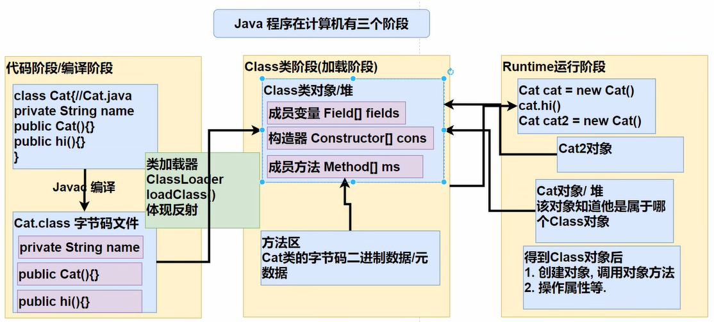

## 一、网络编程

### （一）基本概念

**网络：**两台/多台设备通过物理设备连接起来。

**网络编程：**数据通过网络从一台设备传输到另一台设备。

`java.net`包提供了一系列类、接口，用于实现网络通信。


**ip地址：**唯一标识网络中的每一台计算机。

`ipv6`的长度是`ipv4`的四倍，为128字节，并用16进制表示。


**域名：**www.baidu.com

**端口号：**标识计算机上某个特定的网络程序。（网络开发中，尽量不要使用 $0-1024$ 的端口，因为他们基本已经被知名的服务占用）

**客户端和服务端均使用端口进行监听，客户端的端口是由`TCP/IP`来分配的随机端口，而服务端的端口是双方指定的。**


**协议：**


**TCP：**

1. 传输控制协议；
2. 先建立TCP连接才能使用，传输前采用“三次握手”的方式，是可靠的；
3. TCP协议间通信的两个进程：客户端、服务端；
4. 在连接中可进行大数据量的传输；
5. 传输完毕后需要释放连接，效率低。

**UDP：**

1. 用户数据报协议；
2. 数据、源、目的三者封装成数据包，无需建立连接，是不可靠的；
3. 数据报大小限制在$64K$以内；
4. 无连接，速度快。


**控制台命令：**

`ipconfig`：查看主机的`ip`情况；

`netstat -an`：查看主机网络状况，包括端口监听情况和网络连接情况；

`netstat -anb`：查看主机网络状况，包括监听情况、网络连接情况、监听程序；

`netstat -anb | more`：可以分页显示；

`netstat -anb | find /i "8888"`：从结果中筛选包含`8888`关键字的项。


### （二）InetAddress

```java
// 获取本机的InetAddress对象
InetAddress localHost = InetAddress.getLocalHost();
System.out.println(localHost);  // DESKTOP-U75NRR3/192.168.137.1

// 根据指定主机名获取InetAddress对象
InetAddress host = InetAddress.getByName("www.baidu.com");
System.out.println(host);   // www.baidu.com/110.242.68.4

// 根据InetAddress对象获取域名、ip地址
String name = host.getHostName();
String address = host.getHostAddress();
System.out.println(name + "\n" + address);
// www.baidu.com
// 110.242.68.4
```


### （三）Socket

`Socket`是两台机器间通信的端点，网络通信实际上就是`Socket`通信。

它允许程序把网络当场一个流，数据在两个`Socket`之间通过`IO`流传输（`socket.getInputStream()`和`socket.getOutputStream()`）。


#### 1. TCP编程

##### （1）字节流

**客户端：**

```java
public class SocketTCPClient {
    public static void main(String[] args) throws IOException {
        // 连接本机的9999端口
        Socket socket = new Socket(InetAddress.getLocalHost(), 9999);
        System.out.println("Client linking 9999 port....");

        // 发送消息
        OutputStream oStream = socket.getOutputStream();
        oStream.write("Hello,server!".getBytes());
        socket.shutdownOutput();    // 一定要加这句，表示发送结束，否则会卡住

        // 接收消息
        InputStream iStream = socket.getInputStream();
        byte[] buf = new byte[1024];
        int len = 0;
        while ((len = iStream.read(buf)) != -1) {
            System.out.println(new String(buf, 0, len));
        }

        // 关闭
        oStream.close();
        iStream.close();
        socket.close();
        System.out.println("客户端退出");
    }
}
```

**服务端：**

```java
public class SocketTCPServer {
    public static void main(String[] args) throws IOException {
        // ServerSocket可以创建多个socket，被多个客户端连接
        // 9999端口不能被占用
        ServerSocket serverSocket = new ServerSocket(9999);

        // 没有客户端连接9999端口时会阻塞，否则会返回socket对象
        Socket socket = serverSocket.accept();
        System.out.println("Server listening 9999 port...");

        // 接收消息
        InputStream iStream = socket.getInputStream();
        byte[] buf = new byte[1024];
        int len = 0;
        while ((len = iStream.read(buf)) != -1) {
            System.out.println(new String(buf, 0, len));
        }

        // 回复消息
        OutputStream oStream = socket.getOutputStream();
        oStream.write("Hello,client!".getBytes());
        socket.shutdownOutput();    // 一定要加这句，表示发送结束，否则会卡住

        // 关闭
        iStream.close();
        oStream.close();
        socket.close();
        serverSocket.close();
        System.out.println("服务端退出");
    }
}
```


##### （2）字符流

需要使用转换流，将字节流转为字符流。

**客户端：**

```java
public class SocketTCPClient {
    public static void main(String[] args) throws IOException {
        Socket socket = new Socket(InetAddress.getLocalHost(), 9999);

        // 转换流：OutputStream 转 Writer
        OutputStream oStream = socket.getOutputStream();
        OutputStreamWriter osWriter = new OutputStreamWriter(oStream);
        BufferedWriter writer = new BufferedWriter(osWriter);

        writer.write("Hello, Server!");
        writer.newLine();
        writer.write("嘤嘤嘤...");
        writer.flush();
        socket.shutdownOutput();    // 一定要加这行，否则服务端会一直等待接收信息

        // 转换流：InputStream 转 Reader
        InputStream iStream = socket.getInputStream();
        InputStreamReader isReader = new InputStreamReader(iStream);
        BufferedReader reader = new BufferedReader(isReader);

        String str = reader.readLine();
        System.out.println(str);

        reader.close();
        writer.close();
        socket.close();
        System.out.println("客户端退出");
    }
}

```

**服务端：**

```java
public class SocketTCPServer {
    public static void main(String[] args) throws IOException {
        ServerSocket serverSocket = new ServerSocket(9999);
        Socket socket = serverSocket.accept();

        // 转换流：InputStream 转 Reader
        InputStream iStream = socket.getInputStream();
        InputStreamReader isReader = new InputStreamReader(iStream);
        BufferedReader reader = new BufferedReader(isReader);

        String str = "";
        while ((str = reader.readLine()) != null)
            System.out.println(str);

        // 转换流：OutputStream 转 Writer
        OutputStream oStream = socket.getOutputStream();
        OutputStreamWriter osWriter = new OutputStreamWriter(oStream);
        BufferedWriter writer = new BufferedWriter(osWriter);

        writer.write("Hello,client!");
        writer.newLine();
        writer.flush();

        writer.close();
        reader.close();
        socket.close();
        serverSocket.close();
        System.out.println("服务端退出");
    }
}
```


#### 2. UDP编程

数据、`ip`、对象等都被封装在`DatagramPacket`对象中，没有客户端、服务端之说，只有数据的发送端和接收端。


**发送方：**

```java
public class UDPSender {
    public static void main(String[] args) throws IOException {
        // 由于UDP既可以发送数据，又可以接收数据；
        // 而本程序的发送和接收端都在同一设备上；
        // 所以两边设置的端口最好不一样，便于区分。
        DatagramSocket socket = new DatagramSocket(9998);
        System.out.println("发送方监听9998端口....");

        String str = "bro,拉面以go贼?";
        // 由于本程序的发送和接收端都在同一设备上，所以可以使用 InetAddress.getLocalHost()
        // 但是在一般应用场景中，还是建议使用 InetAddress.getByName("")
        DatagramPacket packet = new DatagramPacket(str.getBytes(),
                str.getBytes().length,
                InetAddress.getByName("192.168.137.1"),
                9999);  // 注意发送中文时的长度，一定是经过编码后的长度
        socket.send(packet);

        // 接收回复
        byte[] data = new byte[1024];
        packet = new DatagramPacket(data, data.length);	// 这里一定要重新new一个，否则接收的数据长度不一定对
        socket.receive(packet);
        int len = packet.getLength();
        data = packet.getData();
        String msg = new String(data, 0, len);
        System.out.println("接收数据长度：" + len);
        System.out.println("接收回复：" + msg);

        socket.close();
        System.out.println("发送端退出");
    }
}
```


**接收方：**

```java
public class UDPReceiver {
    public static void main(String[] args) throws IOException {
        DatagramSocket socket = new DatagramSocket(9999);
        System.out.println("接收方监听9999端口....");

        byte[] bytes = new byte[64 * 1024]; // UDP包最大为64K
        DatagramPacket packet = new DatagramPacket(bytes, bytes.length);

        // 接收信息，填充到packet中
        // 如果没有数据，将会阻塞，一直等待接收数据
        socket.receive(packet);

        // 拆包
        int len = packet.getLength();
        byte[] data = packet.getData();
        String msg = new String(data, 0, len);
        System.out.println("接收数据长度：" + packet.getLength());
        System.out.println("接收数据：" + msg);

        // 回复消息
        String str = "走走走！";
        packet = new DatagramPacket(str.getBytes(),
                str.getBytes().length,
                InetAddress.getByName("192.168.137.1"),
                9998);
        socket.send(packet);

        socket.close();
        System.out.println("接收端退出");
    }
}
```


#### 3. 例题

##### （1）例题一

客户端向服务端发送一张图片，服务端返回消息。

**客户端：**

```java
public class Client {
    public static void main(String[] args) throws IOException {
        Socket socket = new Socket(InetAddress.getLocalHost(), 8888);

        // 创建读取文件
        String path = "e:/背景/5t5.jpg";
        BufferedInputStream biStream = new BufferedInputStream(new FileInputStream(path));
        byte[] bytes = StreamUtils.inputStreamToByteArray(biStream);

        // 获取网络输出流
        OutputStream oStream = socket.getOutputStream();
        oStream.write(bytes);
        oStream.flush();
        socket.shutdownOutput();

        // 接收回复信息
        InputStream iStream = socket.getInputStream();
        String str = StreamUtils.inputStreamToString(iStream);
        System.out.println(str);

        // 关闭流
        iStream.close();
        biStream.close();
        oStream.close();
        socket.close();
        System.out.println("客户端关闭...");
    }
}
```


**服务端：**

```java
public class Server {
    public static void main(String[] args) throws IOException {
        ServerSocket serverSocket = new ServerSocket(8888);
        Socket socket = serverSocket.accept();
        System.out.println("服务端在8888端口监听...");

        // 读入byte[]数据
        BufferedInputStream biStream = new BufferedInputStream(socket.getInputStream());
        byte[] bytes = StreamUtils.inputStreamToByteArray(biStream);

        // 输出到文件
        String path = Server.class.getResource("/").getPath() + "5t5.jpg";
        BufferedOutputStream boStream = new BufferedOutputStream(new FileOutputStream(path));
        boStream.write(bytes);
        System.out.println("服务端图片接收成功！");

        // 回复信息
        BufferedWriter writer = new BufferedWriter(new OutputStreamWriter(socket.getOutputStream()));
        writer.write("服务端：收到!");
        writer.flush();
        socket.shutdownOutput();

        // 关闭流
        writer.close();
        boStream.close();
        biStream.close();
        socket.close();
        serverSocket.close();
        System.out.println("服务端关闭...");
    }
}
```


**工具类：**

```java
public class StreamUtils {

    /**
     * 输入流转byte[]
     *
     * @param iStream 输入流
     * @return byte[]
     * @throws IOException 输入输出异常
     */
    public static byte[] inputStreamToByteArray(InputStream iStream) throws IOException {
        ByteArrayOutputStream baoStream = new ByteArrayOutputStream();
        byte[] buf = new byte[1024];
        int len = 0;
        while ((len = iStream.read(buf)) != -1) {
            baoStream.write(buf, 0, len);
        }
        byte[] array = baoStream.toByteArray();
        baoStream.close();
        return array;
    }

    /**
     * InputStream转String
     *
     * @param iStream 输入流
     * @return 字符串
     * @throws IOException 输入输出异常
     */
    public static String inputStreamToString(InputStream iStream) throws IOException {
        BufferedInputStream biStream = new BufferedInputStream(iStream);
        byte[] buf = new byte[1024];
        int len = 0;
        StringBuilder str = new StringBuilder();
        while ((len = biStream.read(buf)) != -1) {
            str.append(new String(buf, 0, len)).append("\n");
        }
        return str.toString();
    }
}
```


##### （2）例题二

客户端向服务器发送要下载的文件名，服务端返回文件，客户端接收并保存。

（工具类`StreamUtils`同上例）

**客户端：**

```java
public class Client {
    public static void main(String[] args) throws IOException {
        Scanner scanner = new Scanner(System.in);
        System.out.println("请输入文件名：");
        String fileName = scanner.next();

        Socket socket = new Socket(InetAddress.getLocalHost(), 6666);
        OutputStream os = socket.getOutputStream();
        os.write(fileName.getBytes());
        os.flush();
        socket.shutdownOutput();

        // 读取返回的文件
        InputStream is = socket.getInputStream();
        byte[] bytes = StreamUtils.inputStreamToByteArray(is);

        // 保存文件
        BufferedOutputStream bos = new BufferedOutputStream(new FileOutputStream(Server.class.getResource("/").getPath() + fileName));
        bos.write(bytes);

        // 关闭流
        bos.close();
        is.close();
        os.close();
        socket.close();
        System.out.println("客户端退出");
    }
}
```


**服务端：**

```java
public class Server {
    public static void main(String[] args) throws IOException {
        ServerSocket serverSocket = new ServerSocket(6666);
        Socket socket = serverSocket.accept();

        // 获取客户端需求
        InputStream is = socket.getInputStream();
        byte[] bytes = new byte[1024];
        int len = 0;
        String downloadFileName = "";
        while ((len = is.read(bytes)) != -1) {
            downloadFileName += new String(bytes, 0, len);
        }
        System.out.println("下载文件名：" + downloadFileName);

        // 从本地获取文件
        String path = "e:/背景/";
        File file = new File(path, downloadFileName);
        if (!file.exists()) {
            path += "5t5.jpg";
        } else {
            path += downloadFileName;
        }
        BufferedInputStream bis = new BufferedInputStream(new FileInputStream(path));
        byte[] data = StreamUtils.inputStreamToByteArray(bis);

        // 向客户端发送文件
        BufferedOutputStream bos = new BufferedOutputStream(socket.getOutputStream());
        bos.write(data);
        bos.flush();
        socket.shutdownOutput();

        // 关闭流
        bos.close();
        bis.close();
        socket.close();
        serverSocket.close();
        System.out.println("服务端退出");
    }
}
```


## 二、项目

[Java控制台即时通讯系统](https://github.com/WOC-BUG/Java-console-instant-messaging)

（注意，不同项目共用类进行网络传输时，该类所在的包名必须完全一致。因为序列化的对象会加上包名信息，直接使用会认为两者是不同的类。）


## 三、反射

### （一）程序的三个阶段




### （二）基础语法

```java
// 通过全名获取类对象
Class cls = Class.forName("com.cuc.rg.reflection.Cat");

// 创建对象
Object o = cls.newInstance();
System.out.println("o的运行类型" + o.getClass());

// 调用方法
Method method = cls.getMethod("play");
method.invoke(o);

// 获取共有属性
Field age = cls.getField("age");
System.out.println(age.get(o));

// 无参构造器
Constructor constructor = cls.getConstructor();
System.out.println(constructor);

// 有参构造器
Constructor constructor1 = cls.getConstructor(String.class);
System.out.println(constructor1);
```


### （三）反射性能

#### 1. 对比

```java
public class Index {
    public static void main(String[] args) {
        m1();
        m2();
    }

    // 普通调用方法
    public static void m1() {
        Cat cat = new Cat();
        long start = System.currentTimeMillis();
        for (int i = 0; i < 90000000; i++) {
            cat.eat();
        }
        long end = System.currentTimeMillis();
        System.out.println("m1()耗时：" + (end - start) + "毫秒");
    }

    // 反射调用方法
    public static void m2() {
        try {
            Class cls = Class.forName("com.cuc.rg.reflection.Cat");
            Object o = cls.newInstance();
            Method eat = cls.getMethod("eat");

            long start = System.currentTimeMillis();
            for (int i = 0; i < 90000000; i++) {
                eat.invoke(o);
            }
            long end = System.currentTimeMillis();
            System.out.println("m2()耗时：" + (end - start) + "毫秒");
        } catch (Exception e) {
            e.printStackTrace();
        }
    }
}

/* 输出：
m1()耗时：8毫秒
m2()耗时：530毫秒
*/
```

#### 2. 优化

```java
// 在反射调用方法时，取消访问检测
// 能在一定程度上优化效率
eat.setAccessible(true);

/* 输出：
m1()耗时：9毫秒
m2()耗时：232毫秒
*/
```


