## 设计模式

### 类图

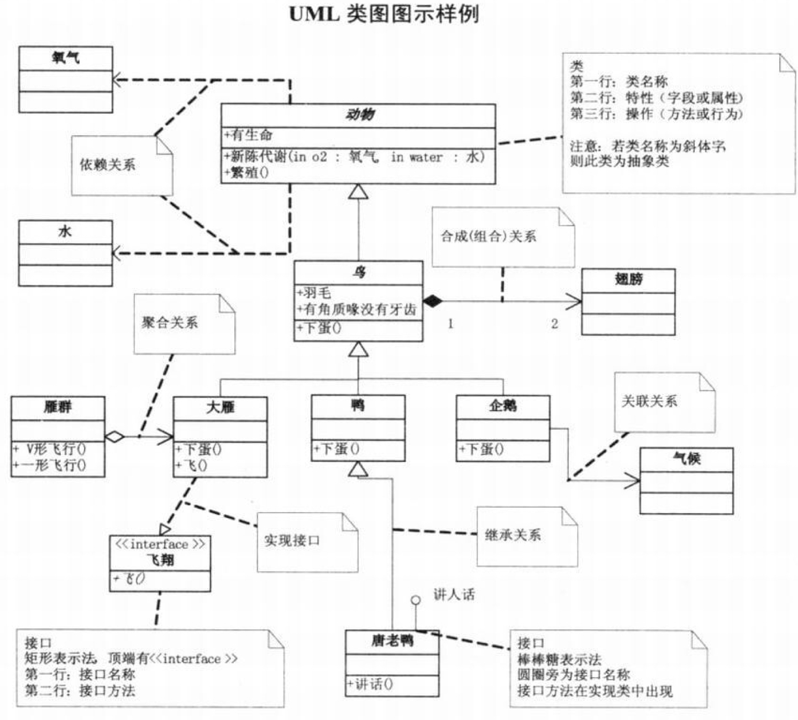

---

### 面向对象设计六大原则

#### 单一职责原则

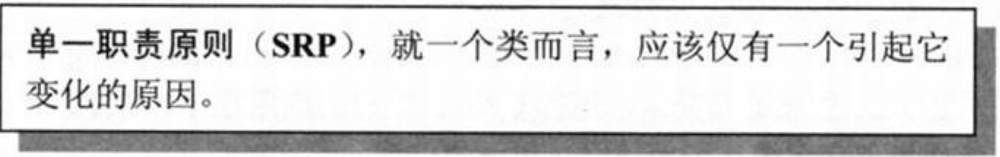


#### 开放封闭原则

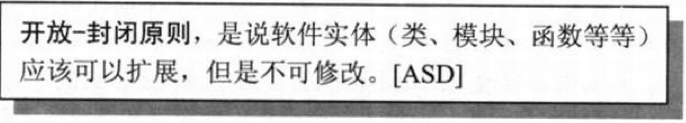

#### 依赖倒置原则

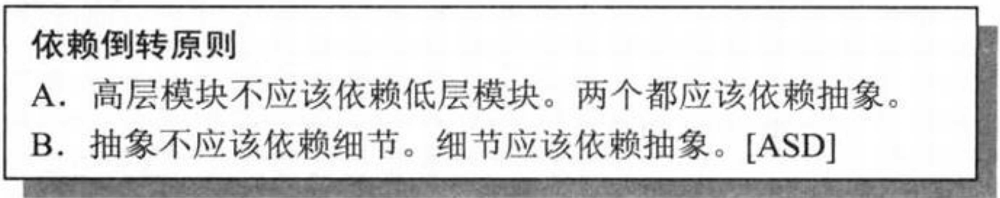


#### 迪米特法则


---

### 单例模式

#### 饿汉模式

1. 构造器私有化
2. 在类内部直接创建`static`对象
3. 提供返回实例的`static`方法，不创建对象也会有该实例

```java
public class Singleton{
    private String name;
    private static Singleton instance = new Singleton("张三");
    
    private Singleton(String name){
        this.name = name;
    }
    
    public static Singleton getInstance(){
        return instance;
    }
}
```


#### 懒汉模式

1. 构造器私有化
2. 定义`static`实例
3. 提供返回该实例的`static`方法，当用户调用时才创建对象并返回

```java
public class Singleton{
    private String name;
    private static Singleton instance;
    
    private Singleton(String name){
        this.name = name;
    }
    
    public static Singleton getInstance(){
        if(instance == null){
            synchronized(this){
                if(instance == null){
                    instance = new Singleton("张三");
                }
            }
        }
        return instance;
    }
}
```


### 简单工厂模式

该模式主要负责解决对象的创建问题，工厂类负责根据不同的需求生产对象。

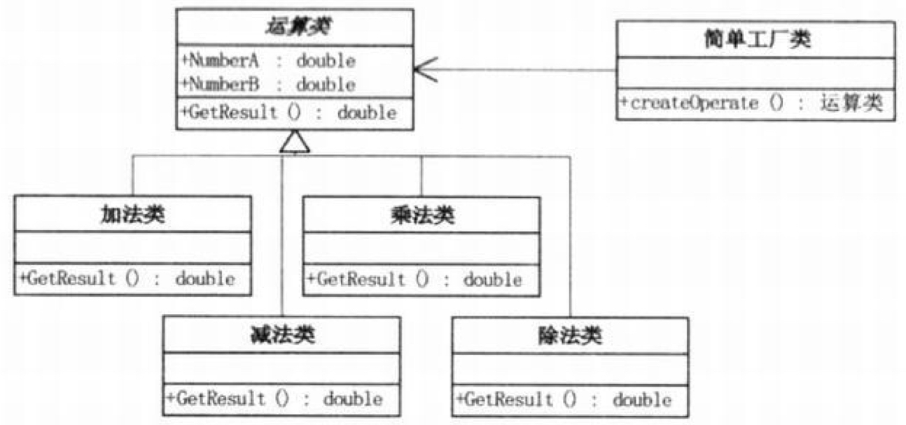

**优点：**

1. 客户端免于负责创建产品的责任。
2. 可以不修改客户端代码增加产品，提高系统灵活性。

**缺点：**

1. 工厂类集中了所有创建对象的逻辑，容易对系统造成影响。
2. 一旦商品发生增减，就要修改工厂类破坏封装性。

**使用场景：**

1. 所需创建对象数量较少，改动少
2. 客户端无需关心对象的创建


---


### 工厂方法模式

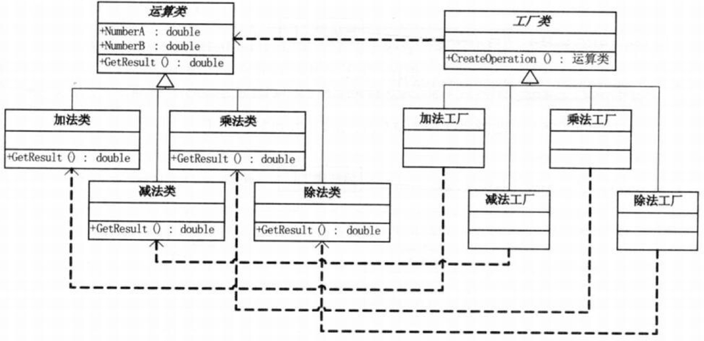

**优点：**

1. 向客户隐藏了哪种具体产品类被实例化这一细节。
2. 加入新产品时，无需修改抽象工厂和抽象产品提供的接口，有非常良好的扩展性。

**缺点：**

1. 在添加新产品时，还要提供对应的具体工厂类，系统中类的个数将成对增加，增加了系统的复杂度。
2. 将逻辑判断移到客户端进行，增加客户端负担。这个可以用反射解决。

**使用场景：**

同工厂模式。


---


### 策略模式

在简单工厂模式的基础上，将创建产品的责任又放回客户端，采用多态，`Context`中使用父类参数，传入子类对象做出自己的行为。

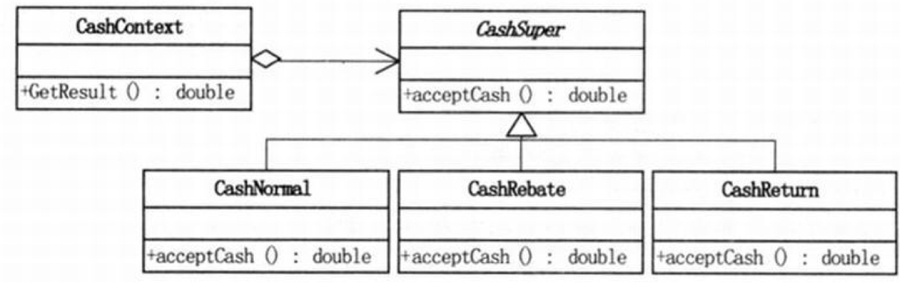

**优点：**

1. 算法可以自由切换，扩展性好

2. 采用多态，避免使用多重条件判断

**缺点：**

1. 客户端要负责创建产品，功能重
2. 所有策略类都需要对外暴露

**使用场景：**

1. 若一个系统里面有许多类，它们之间的区别仅在于它们的行为，使用策略模式可以动态地让一个对象在许多行为中选择一种行为。

2.  一个系统需要动态地在几种算法中选择一种。
3.  如果一个对象有很多的行为，如果不用恰当的模式，这些行为就只好使用多重的条件选择语句来实现。


**改进：简单工厂模式和策略模式结合**

将对象的创建放在`Context`类中，再使用多态做出对象各自的行为。


---


### 装饰模式

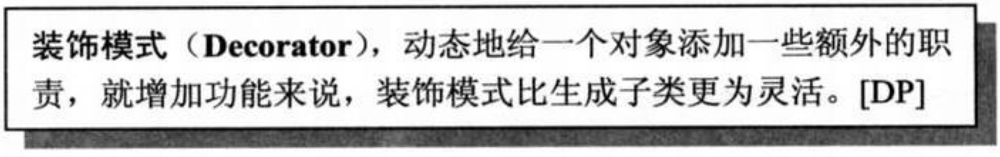


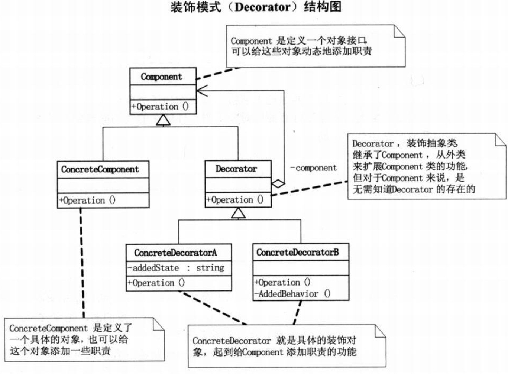

<font color='green'>若没有`Component`，那么可以让`Decorator`继承`ConcreteComponent`。若只有一个`ConcreteDecorator`，那就没必要加`Decorator`类。</font>


就是对于 人-衣服-裤子-鞋子 的组合，先创建人对象，让衣服包裹人，然后让裤子包裹衣服，鞋子包裹裤子：

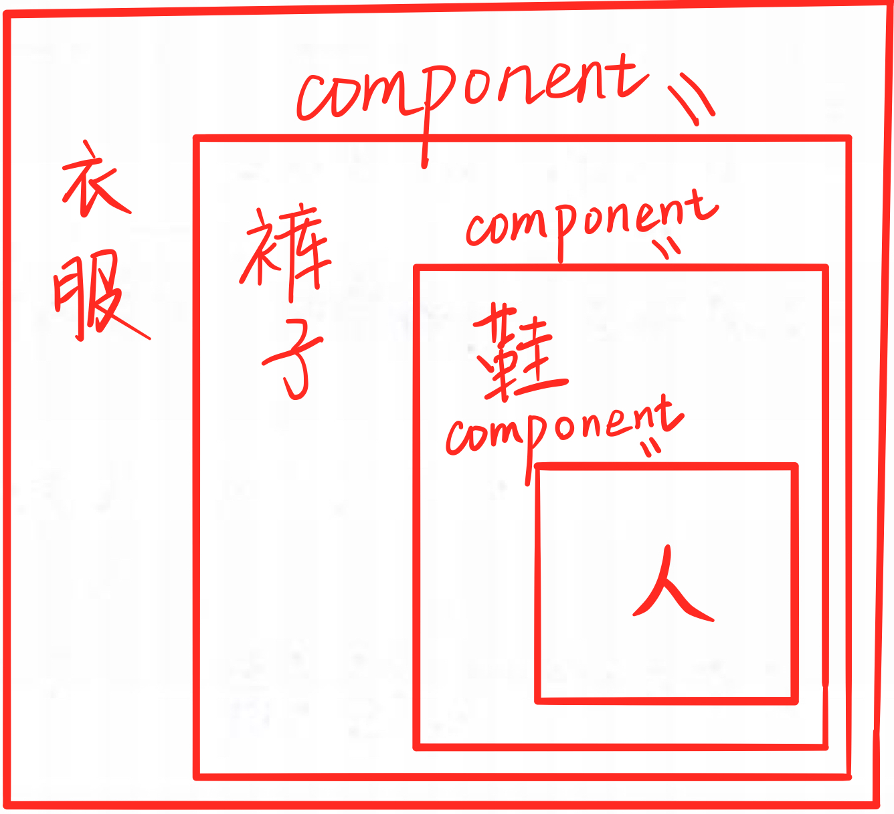

**优点：**

1. 有效地把类的核心职责和装饰功能区分开，且去除了重复逻辑
2. 为已有的功能动态地添加更多的功能

**缺点：**

1. 装饰顺序很重要，多层装饰复杂容易出错

**使用场景：**

1. 对象的创建过程是不稳定的，就像搭配衣服一样可以有好几种组合方式

1. 扩展一个类的功能

1. 动态增加功能，动态撤销

   

---


### 代理模式


**优点：**

1. 代理模式能将代理对象与真实被调用的目标对象分离。

2. 一定程度上降低了系统的耦合度，扩展性好。

3. 可以起到保护目标对象的作用。

4. 可以对目标对象的功能增强。

**缺点：**

1. 代理模式会造成系统设计中类的数量增加。

2. 在客户端和目标对象增加一个代理对象，会造成请求处理速度变慢。

3. 增加了系统的复杂度。

**使用场景：**

1. 远程代理：

   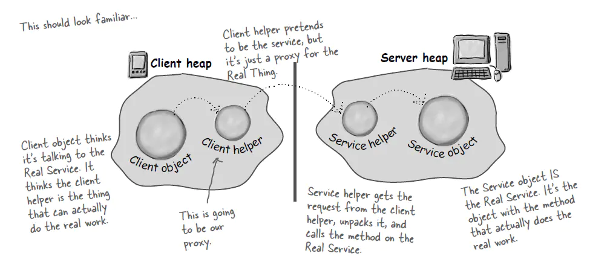

1. 虚拟代理：推迟真正所需对象实例化时间. 在需要真正的对象工作之前, 如果代理对象能够处理, 那么暂时不需要真正对象来出手

1. 安全代理：即上图中提到的情况，用于控制真实对象的访问权限

1. 智能指针


---


### 原型模式

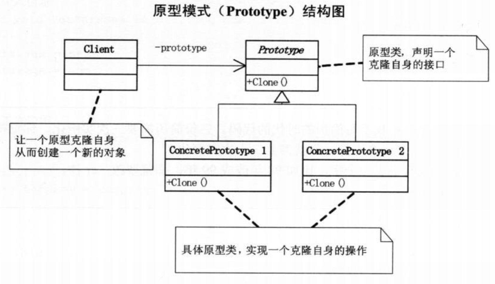

(注意，Java中已有实现好的 `Prototype` 接口，叫 `Cloneable`，但由于它是浅拷贝，所以类中存在其他对象时，要在最内层对象实现该接口，其他部分逐变量拷贝)

**优点：**

1. 使用原型模式创建对象比直接new一个对象在性能上要好的多，因为Object类的clone方法是一个本地方法，它直接操作内存中的二进制流，特别是复制大对象时，性能的差别非常明显。
2. 简化对象的创建。

**缺点：**

1. 使用原型模式时不能够有 `final` 对象，因为带有 `final` 类型的对象无法进行拷贝。
2. `Object` 类的 `clone` 方法是浅拷贝，对于复杂的数据类型只能够另行拷贝。
3. 使用原型模式复制对象不会调用类的构造方法，而是通过调用 Object 类的 clone 方法来完成的，它直接在内存中复制数据，所以不会调用类的构造方法。单例模式中，只要将构造方法设置为私有的访问权限，就可以实现单例。但是 **`clone` 方法直接无视私有访问权限**，单例模式和原型模式在使用过程中是冲突的，需要特别注意。

**使用场景：**

1. 性能和安全要求的场景。
2. 通过 new 产生一个对象非常繁琐。
3. 一个对象多个修改者的场景。
4. 在实际项目中，原型模式很少单独出现，一般是和工厂方法模式一起出现，通过 clone 的方法创建一个对象，然后由工厂方法提供给调用者。


---


### 模板方法模式

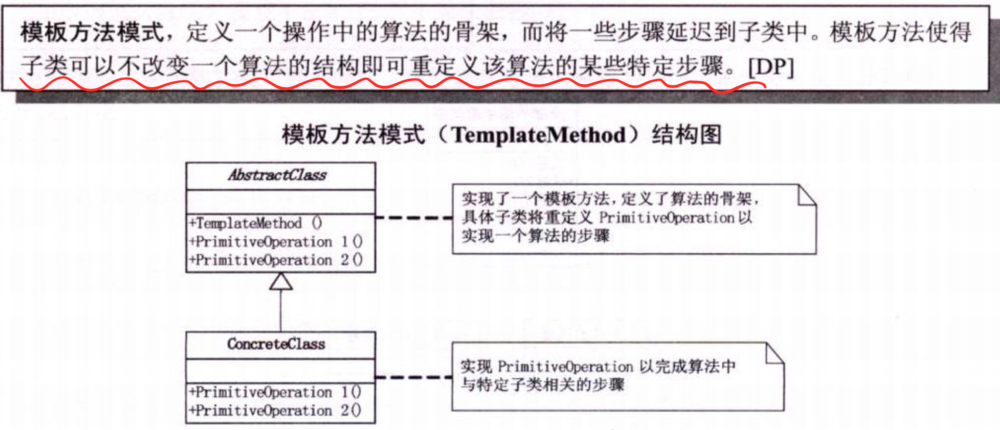


**代码：**

```java
public abstract class Template {
    
    public abstract void job();
    
    // 计算job运行的时间
    public void calculateTime() {
        long startTime = System.currentTimeMillis();
      	job();
        long endTime = System.currentTimeMillis();
        System.out.println("耗时：" + (endTime-startTime));
    }
}

public class A extends Template {
    @Override
    public void job() {
        int ans = 0;
        for(int i=1;i<100000;i++) {
            ans +=i;
        }
    }
}

public class B extends Template {
    @Override
    public void job() {
        int ans = 1;
        for(int i=1;i<100000;i++) {
            ans *=i;
        }
    }
}

public class Main {
    public static void main(String[] args){
        new AA().calculateTime();
        new BB().calculateTime();
    }
}
```


**优点：**

1. 把不便的行为搬到超类，去除子类的重复代码，提高代码的复用性，符合开闭原则。
2. 将不同的代码不同的子类中，通过对子类的扩展增加新的行为，提高代码的扩展性。

**缺点：**

1. 每一个抽象类都需要一个子类来实现，这样导致类的个数增加，间接地增加了系统实现的复杂度。
2. 继承关系自身缺点，如果父类添加新的抽象方法，所有子类都要改一遍。

**使用场景：**

1. 一系列步骤构成的过程，从高层次看是相同的，但是细节的实现上不同。